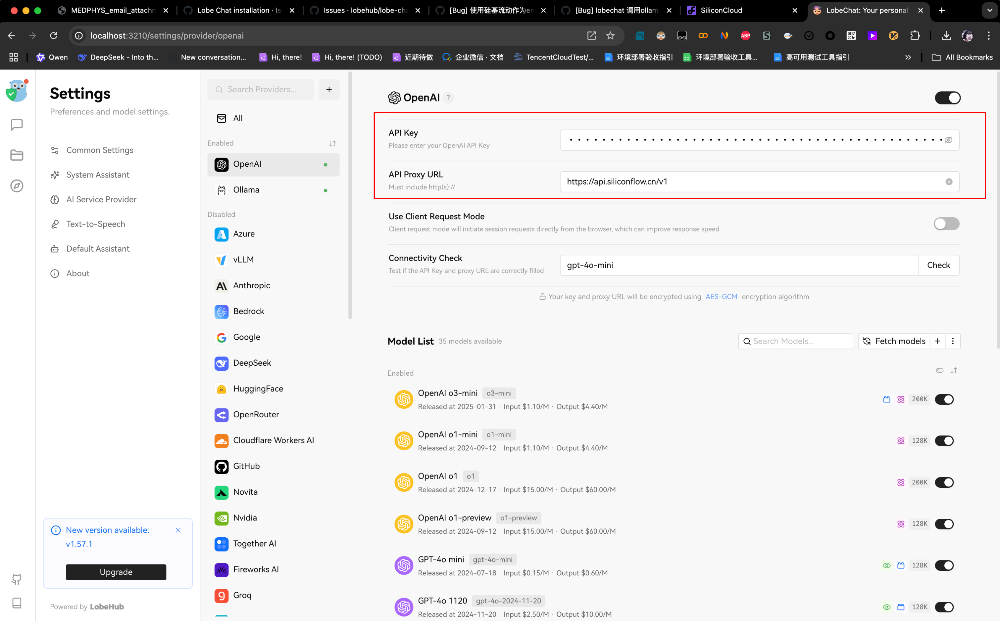

# AI workflow software

## Chatbots overview

| URL                                             | Description                                                                                                                       |
| ----------------------------------------------- | --------------------------------------------------------------------------------------------------------------------------------- |
| <https://github.com/langgenius/dify>            | Production-ready platform for agentic workflow development.                                                                       |
| <https://github.com/ChatGPTNextWeb/NextChat>    | Light and Fast AI Assistant. Support: Web \| iOS \| MacOS \| Android \| Linux \| Windows                                          |
| <https://github.com/infiniflow/ragflow>         | RAGFlow is an open-source RAG (Retrieval-Augmented Generation) engine based on deep document understanding.                       |
| <https://github.com/Mintplex-Labs/anything-llm> | The all-in-one Desktop & Docker AI application with built-in RAG, AI agents, No-code agent builder, MCP compatibility, and more.  |
| <https://github.com/chatboxai/chatbox>          | User-friendly Desktop Client App for AI Models/LLMs (GPT, Claude, Gemini, Ollama...)                                              |
| <https://github.com/CherryHQ/cherry-studio>     | 🍒 Cherry Studio is a desktop client that supports for multiple LLM providers.                                                    |
| <https://github.com/getAsterisk/deepclaude>     | A high-performance LLM inference API and Chat UI that integrates DeepSeek R1's CoT reasoning traces with Anthropic Claude models. |

## Openai official ChatGPT

需要：
ios设备，梯子环境，美区账号(地区在美国五个免税州内)，支付宝，chatgpt账号

步骤：

- ios设备，地区切换到美国，系统语言切换英文
- 美区账号下载chatgpt app
- 通过支付宝小程序给美区账号充值礼品卡
- chatgpt app登录账号，通过美区账号充值gpt4

其他：到这个[链接](https://platform.openai.com/api-keys)中登录获取api key,然后部署到其他地方(但由于后面好像还要充值，没再继续部署)

## Ollama

> Ref: <https://github.com/ollama/ollama>

### Deploy ollama with Chinese mirror

> Ref: <https://tianhao.tech/default/ollama-installation-guide-china.html>

```bash
curl -fsSL https://ollama.com/install.sh -o ollama_install.sh
```

Replate the download URL in `ollama_install.sh`:

```bash
#!/bin/bash

FILE="ollama_install.sh"

sed -i 's|https://ollama.com/download/ollama-linux-${ARCH}${VER_PARAM}|https://github.moeyy.xyz/https://github.com/ollama/ollama/releases/download/v0.3.4/ollama-linux-amd64|g' $FILE
sed -i 's|https://ollama.com/download/ollama-linux-amd64-rocm.tgz${VER_PARAM}|https://github.moeyy.xyz/https://github.com/ollama/ollama/releases/download/v0.3.4/ollama-linux-amd64-rocm.tgz|g' $FILE
```

```bash
http_proxy=127.0.0.1:7890 https_proxy=127.0.0.1:7890 ollama run deepseek-r1:32b
```

### Deploy ollama in autodl machine

> Ref: <https://blog.csdn.net/tirestay/article/details/139773544>

```bash
source /etc/network_turbo
sudo apt update
sudo apt install systemd systemctl lshw
curl -fsSL https://ollama.com/install.sh | sh
# systemctl start ollama.service
# kill -9 [ollama process number]
http_proxy=127.0.0.1:7890 https_proxy=127.0.0.1:7890 OLLAMA_MODELS=/root/autodl-tmp/ollama ollama serve
http_proxy=127.0.0.1:7890 https_proxy=127.0.0.1:7890 OLLAMA_MODELS=/root/autodl-tmp/ollama ollama run deepseek-r1:70b
```

## GPT Academic (in autodl machine)

> Ref: <https://github.com/binary-husky/gpt_academic>

```bash
source /etc/network_turbo
http_proxy=127.0.0.1:7890 https_proxy=127.0.0.1:7890 git clone --depth=1 https://github.com/binary-husky/gpt_academic.git
cd gpt_academic
cp config.py config_private.py
vim config_private.py
conda init
source ~/.bashrc
conda create -n gptac_venv python=3.11
conda activate gptac_venv
python -m pip install -r requirements.txt
python main.py
```

## Lobe Chat

> Ref: <https://github.com/lobehub/lobe-chat>

### Re-Deploy Lobe Chat with docker compose

注意：重新安装时，只需要删掉lobe-chat容器，然后拉取最新lobe-chat容器，执行`docker compose up -d`。不要删除`docker-compose.yml`和`init_data.json`，也不要删除`data`和`s3_data`。否则之前的数据就丢失了。代码是否拉取最新的无所谓。因为使用的并不是最新代码提供的docker compose文件，而是本地的。

```bash
docker rm -f lobe-chat
docker pull lobehub/lobe-chat-database:latest
docker compose up -d  # Or: docker-compose up -d
```

### First deploy Lobe Chat with docker compose

```text
Based on: https://github.com/lobehub/lobe-chat
Branch: main
Commit: efb9311e6f3c
```

```bash
pwd
# /Users/yusongli/Documents

git clone git@github.com:ysl2/lobe-chat.git
cd lobe-chat/docker-compose/local
bash setup.sh
# Select the second option: Port mode

docker compose up -d
```

### Embedding model configuration

把这里换成siliconflow的key和proxy，用于embedding模型



关键的`.env`配置如下:

```bash
# DEFAULT_FILES_CONFIG=embedding_model=siliconcloud/Pro/BAAI/bge-m3
DEFAULT_FILES_CONFIG=embedding_model=siliconcloud/Qwen/Qwen3-Embedding-0.6B
```

PS: 413是因为该模型不支持1024维，换了BAAI后正常。

> Ref: 刚刚去看了代码实现，代码实现是通过从`$DEFAULT_FILES_CONFIG` 截取 PROVIDER 来组合提取env中存在的`${PROVIDER}_API_KEY`,`${PROVIDER}_PROXY_URL` 来构建对应的请求的，如果没有`${PROVIDER}_API_KEY`会使用`$OPENAI_API_KEY`来兜底，兜底这个行为本身需要斟酌，因为可能导致没有正确配置的环境把openai的key暴露到不匹配的provider，但是代码逻辑本身没有问题。
> 最后我使用相同环境下重新部署了一次，没有再次复现这个问题。
