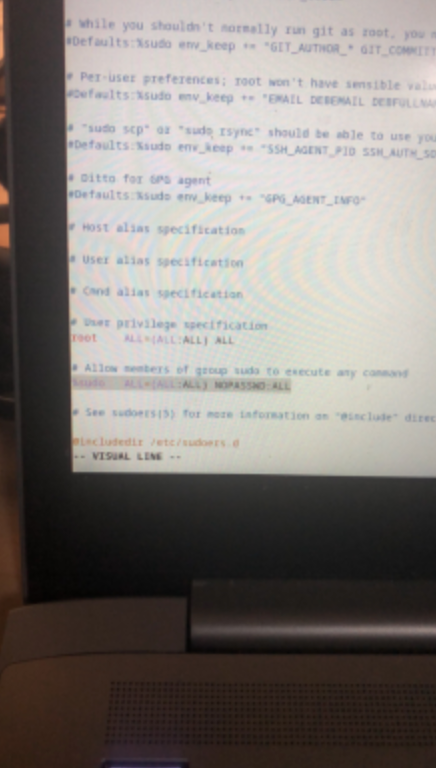
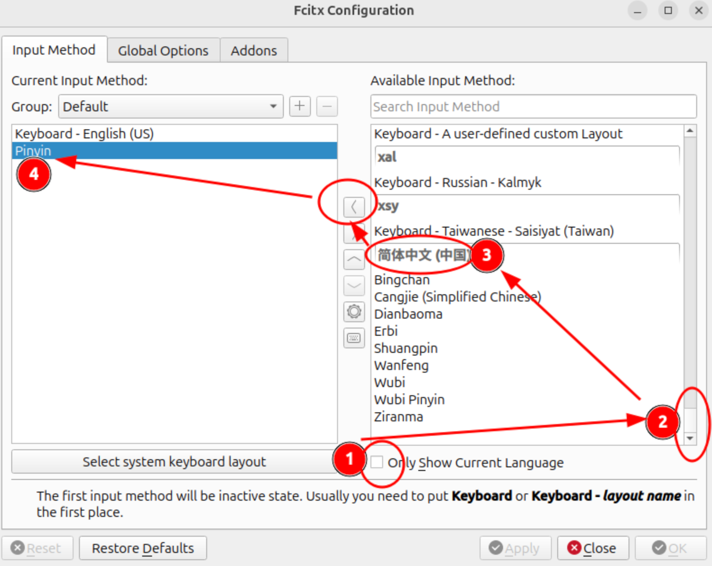
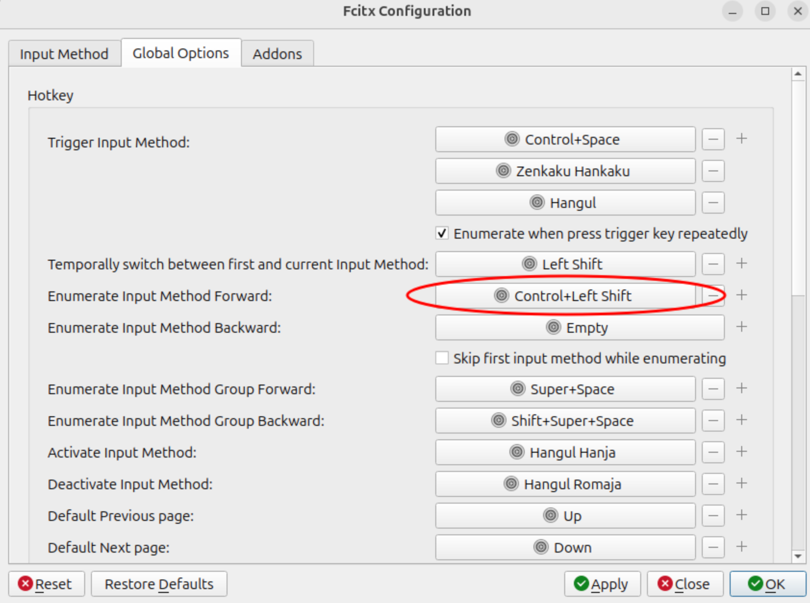
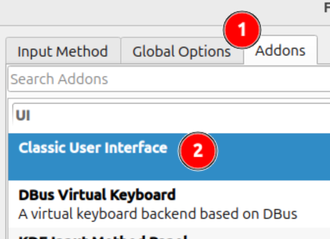
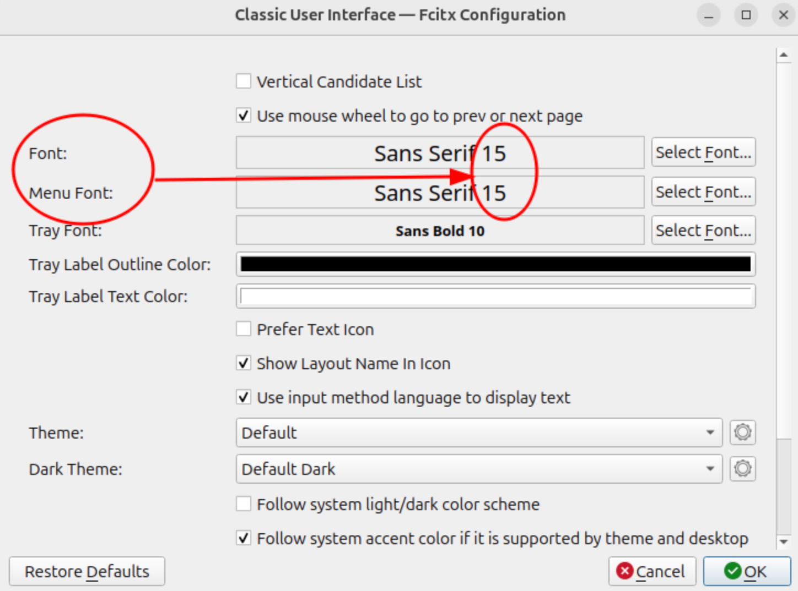

# [common] Home

- debian下载（本地包）
  - <https://cdimage.debian.org/debian-cd/current/amd64/iso-dvd>
- dd命令做安装盘
  - sudo dd if=/path/to/debian.iso of=/dev/sdX bs=4M status=progress oflag=sync
- 安装。注意分区efi，512M，否则没法开机
- 搭建clash，需要clash执行文件和country.mmdb
- firefox设置代理，设置里面搜proxy
- 上传github公钥
- 当前用户添加到sudo
  - su -
  - usermod -aG sudo yusongli
- 换清华源，testing，然后更新
- 安装vim，git
- 设置sudo免密
  - 
- 配置github的ssh走443端口
- 克隆dotlib，dotfiles，并放好
- 运行触摸板按压脚本，在`~/.scripts/window-manager/fix-touchpad.sh`
- 安装i3，i3blocks，st-flexipatch，dmenu-flexipatch（注意依赖），并且克隆自己的i3配置仓库，做xsession桌面启动文件，安装firacode，设置启动脚本（注意，安装pip和链接python3到python，依赖项和脚本权限777）
- chrome, install from source
- 中文输入
  - Ref: <https://www.seektao.cc/archives/debian12-input-method-chinese>
  - sudo apt-get install fcitx5 fcitx5-chinese-addons
  - 然后在fcitx- configuration里面添加拼音
    - 
  - set keymap
    - 
  - 设置菜单大小为15，并且在这个页面往下翻，关闭选项“Use Per Screen DPI on X11”
    - 
    - 
- 微信
  - 星火应用商店，注意切换到debian桌面，然后再下载微信，最后把微信启动脚本链接到PATH里面。刚开始的时候会一直提示wine无响应，是因为正在加载，等加载完就好了
- nvim
  - node和yarn
  - 克隆nvim仓库
  - sudo apt install -y xclip zathura texlive-full
- 工作仓库
  - yunet.thesis (gitee)，需要同时设置github地址
  - yunet.ppt (gitee)
  - drawio (gitee)
- cargo install pfetch
- 安装miniconda并设置MYCONDA变量和toconda
- P ysl chafa
- sudo apt install tmux
- 通过星火应用商店安装wps
- sudo apt install nvidia-driver
