# [mac] Home

## 网络设置与配置恢复

- 手机在mihomo party的github release页面下载dmg，发送到mac上安装。导入节点信息
- `xcode-select --install`
- 手动添加ssh的github 443端口配置
- 创建ssh keypair并添加到github
- git clone dotfiles和dotlinks -b mac，并执行恢复动作

## 依赖安装

```bash
/bin/bash -c "$(curl -fsSL https://ghfast.top/https://raw.githubusercontent.com/Homebrew/install/HEAD/install.sh)"
```

### 包列表

```text
❯ brew list -1 --installed-on-request
atuin
autossh
bash
borders
chafa
colima
docker
docker-buildx
docker-compose
fastfetch
fzf
gemini-cli
gnu-sed
go
htop
kind
lf
ncdu
neovim
node
pngpaste
reattach-to-user-namespace
redshift
ripgrep
rustup
sketchybar
starship
switchaudio-osx
tmux
trzsz-go
uv
wget
zathura
zathura-pdf-mupdf
zathura-pdf-poppler
```

```text
❯ brew list -1 --casks
aerospace
alt-tab
baidunetdisk
chatbox
cursorcerer
font-fira-code-nerd-font
jiggler
keycastr
obsidian
parallels
quickrecorder
raycast
scroll-reverser
snipaste
```

### 特殊依赖安装

```bash
brew install rustup
rustup-init
```

### Cleanup

```bash
brew cleanup --prune=all -s --dry-run
brew cleanup --prune=all -s
```

## 全局配置

```bash
defaults write -g NSAutomaticWindowAnimationsEnabled -bool false
defaults write -g NSAutomaticPeriodSubstitutionEnabled -bool false
defaults write -g ApplePressAndHoldEnabled -bool false
```

## System settings

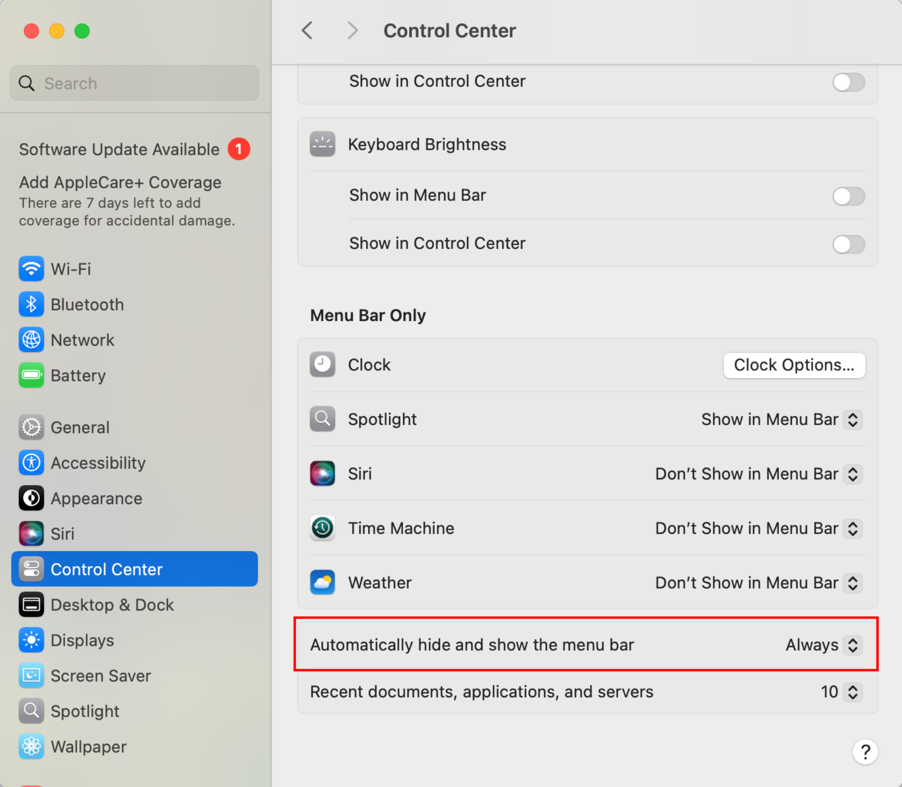


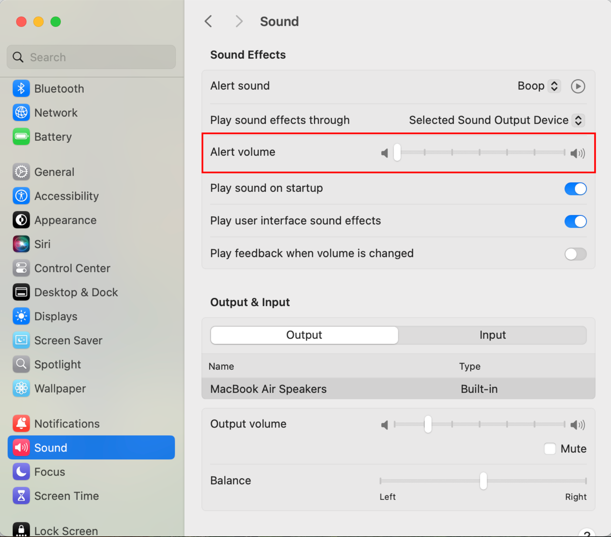


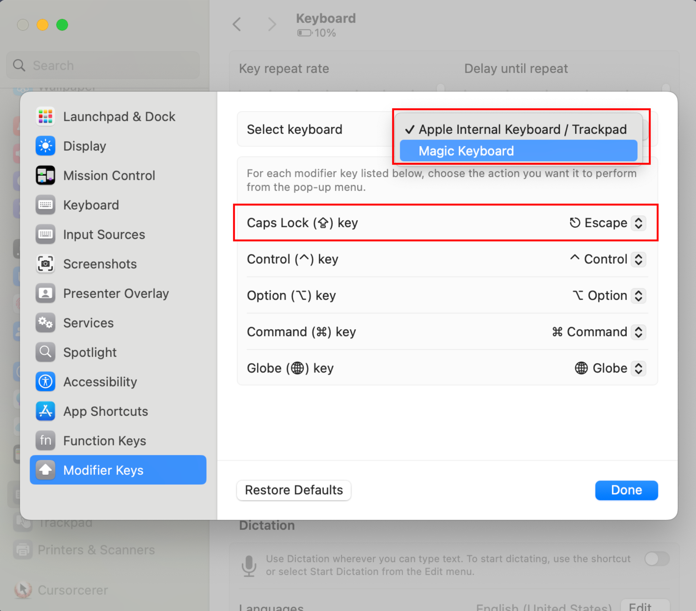


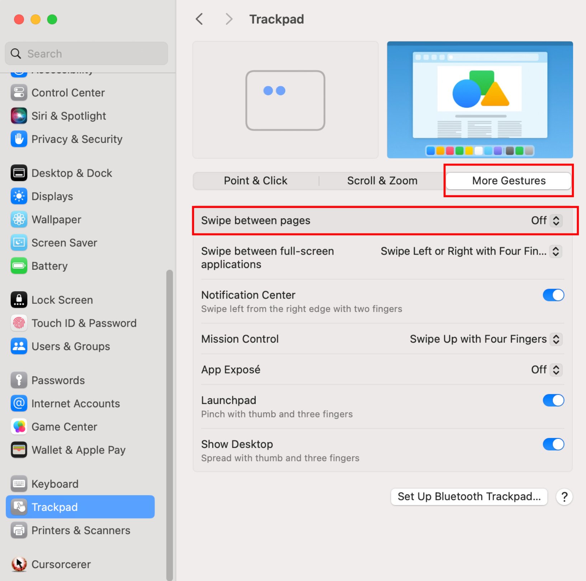

## Other settings

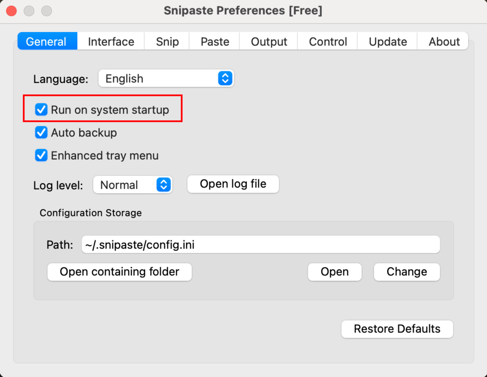


---


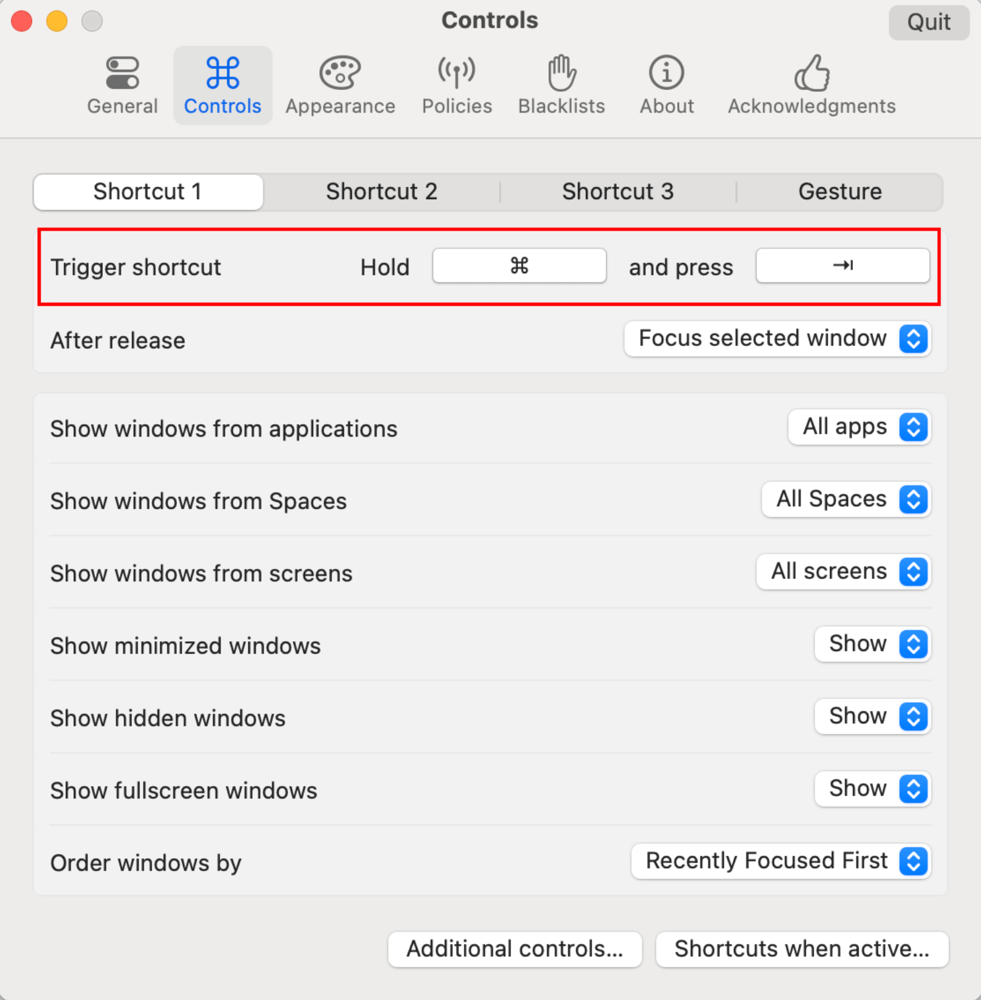

---


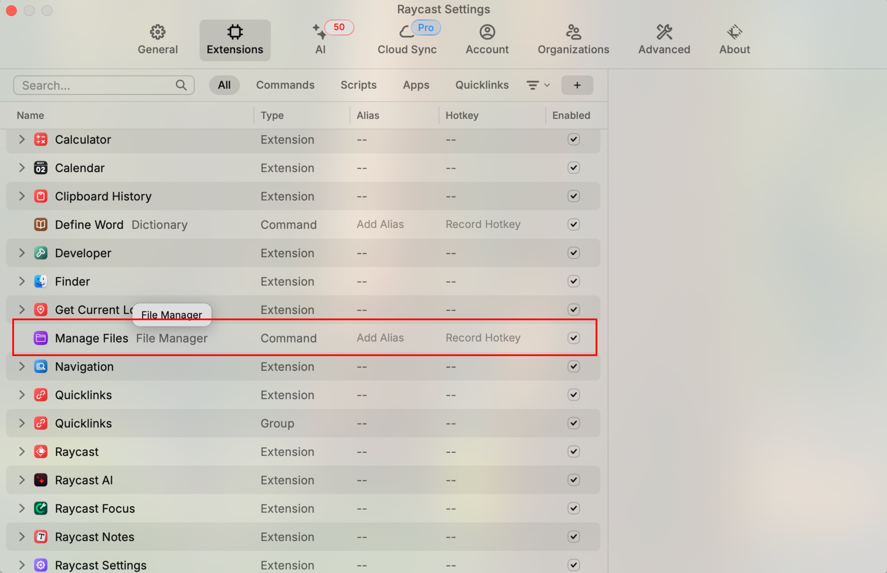


---


---

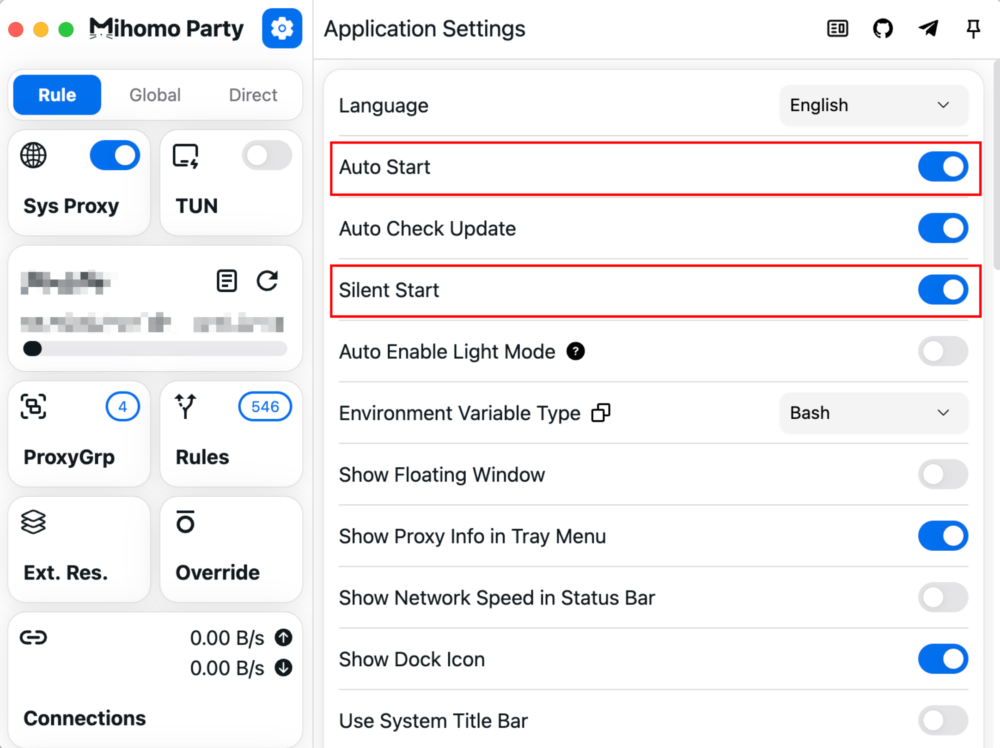

---

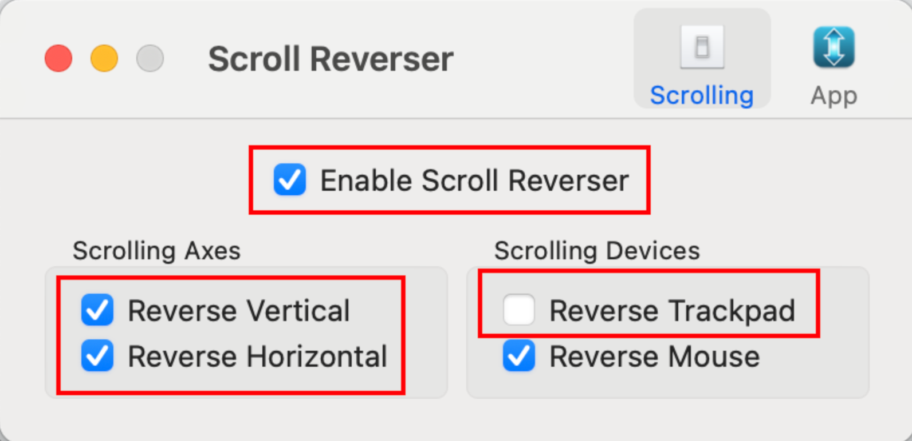

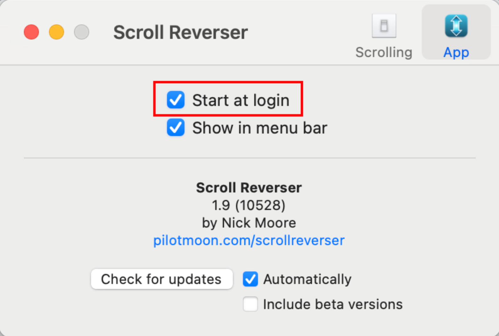

---

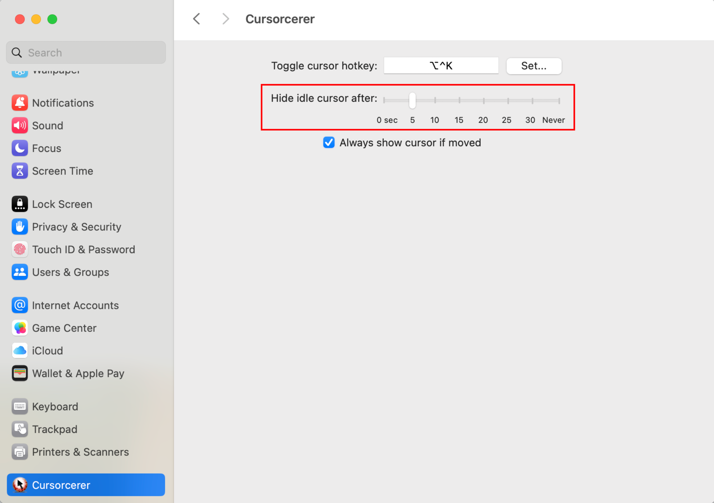

---

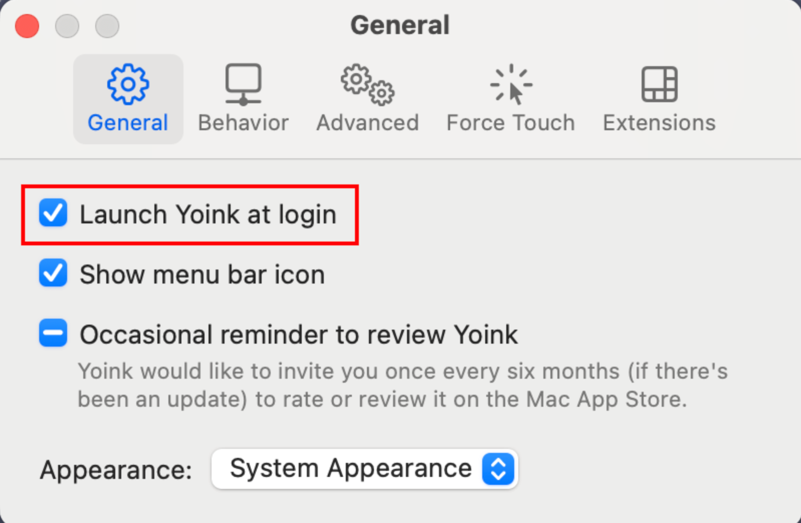


