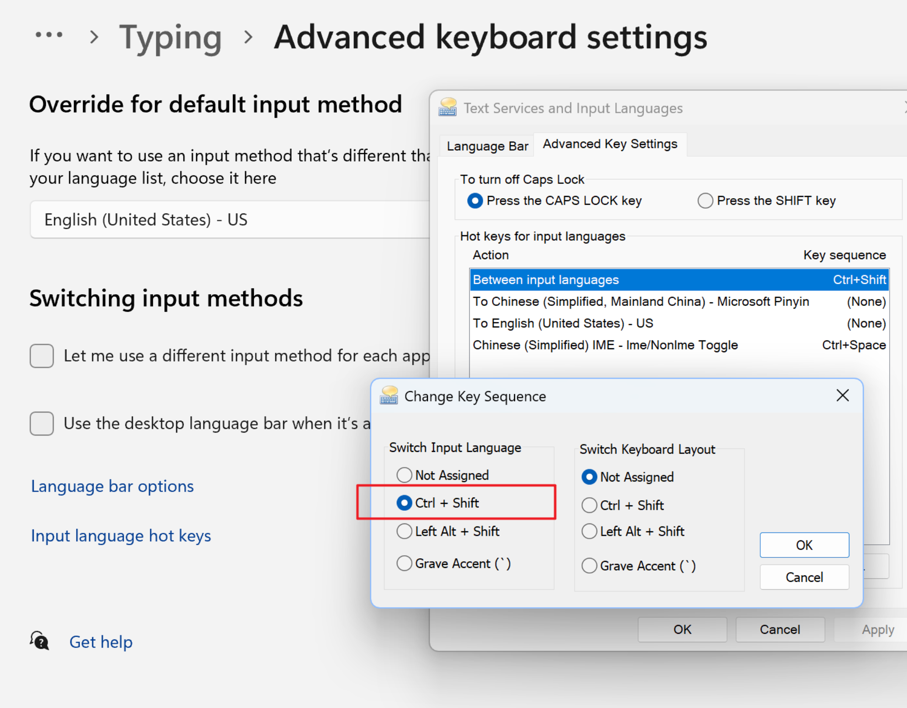
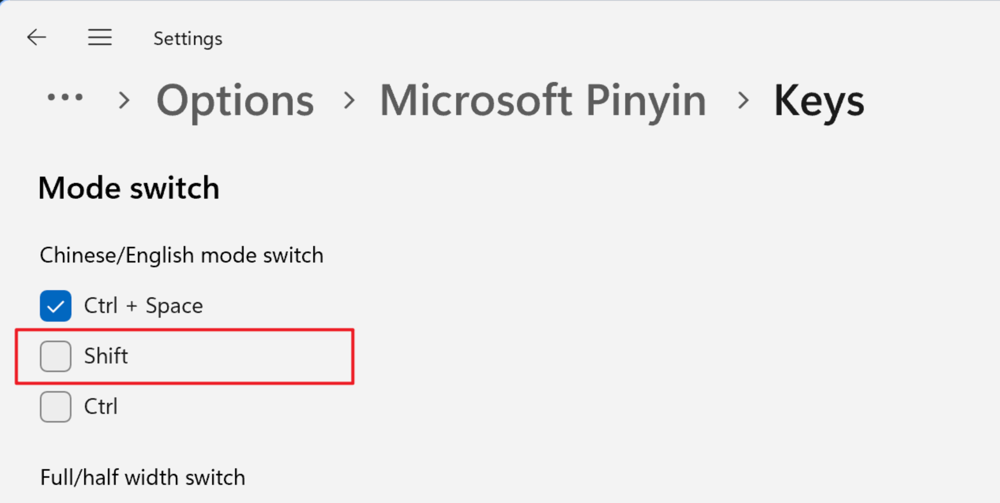
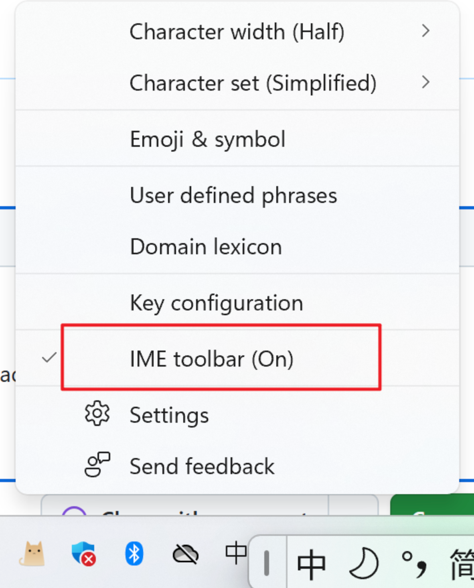
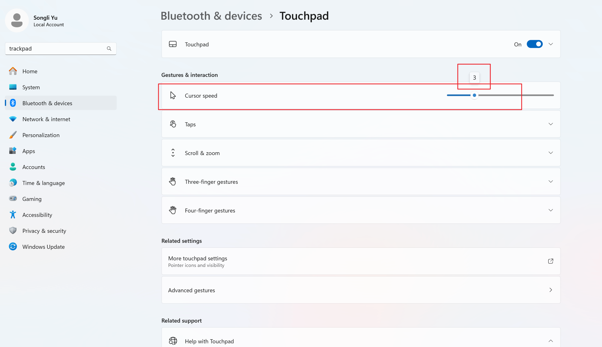

# [windows] Home

## Installation on Windows

### dotfiles

```powershell
# NOTE:
# 1. You should open the `Developer Mode` item in Windows `Settings -> Update & Security -> Developer
# 2. Don't use administrator terminal, instead, use your normal terminal.
git clone -c core.symlinks=true git@github.com:ysl2/.dotfiles.git
git clone -c core.symlinks=true git@github.com:ysl2/.dotlinks.git -b windows
```

### Special packages

```bash
# Don't use this to install texlive, instead, install it manually by local install.
# Ref: https://github.com/ysl2/.dotfiles/issues/34
choco install texlive --params="'/scheme:full'"
choco install ntop.portable

# Update: don't use conda, instead, use original python
# That's beacuse you might encounter the SSL problem, annoying :-<
choco install miniconda3
# Add to PATH:
# C:\tools\miniconda3
# C:\tools\miniconda3\Scripts

# Cmake
# Add to PATH: C:\Program Files\CMake\bin
```

### Other packages

```powershell
❯ choco list
Chocolatey v2.4.3
alacritty 0.15.1
alacritty.install 0.15.1
brave 1.76.80
chocolatey 2.4.3
chocolatey-compatibility.extension 1.0.0
chocolatey-core.extension 1.4.0
chocolatey-dotnetfx.extension 1.0.1
chocolatey-fastanswers.extension 0.0.2.2
chocolatey-font-helpers.extension 0.0.4
chocolatey-visualstudio.extension 1.11.1
chocolatey-windowsupdate.extension 1.0.5
diskgenius 5.6.1.1580
dos2unix 7.5.2
dotnet 9.0.3
dotnet-9.0-runtime 9.0.3
dotnet-9.0-sdk 9.0.201
dotnet-9.0-sdk-2xx 9.0.201
dotnetfx 4.8.0.20220524
dotnet-runtime 9.0.3
dotnet-sdk 9.0.201
fastfetch 2.38.0
Firefox 136.0.2
flow-launcher 1.19.5
fzf 0.59.0
git 2.48.1
git.install 2.48.1
glazewm 3.8.1
golang 1.24.1
KB2919355 1.0.20160915
KB2919442 1.0.20160915
KB2999226 1.0.20181019
KB3033929 1.0.5
KB3035131 1.0.3
KB3118401 1.0.5
lazygit 0.48.0
lf 0.26.0
llvm 20.1.0
make 4.4.1
mpvio 0.39.0
mpvio.install 0.39.0
neovim 0.10.4
nerd-fonts-FiraCode 3.3.0
nodejs 23.10.0
nodejs.install 23.10.0
nushell 0.103.0
nushell.install 0.103.0
ObinsKit 1.2.11
obs-studio 31.0.3
obs-studio.install 31.0.3
patch 2.5.9
powershell-core 7.5.0
pwsh 7.5.0
python 3.13.2
python3 3.13.2
python313 3.13.2
redshift 1.12.0
ripgrep 14.1.0
sharpkeys 3.5.0.20180307
snipaste 2.10.5
starship 1.22.1
starship.install 1.22.1
strawberryperl 5.40.0.1
sumatrapdf 3.5.2
sumatrapdf.install 3.5.2
unzip 6.0.0.20250209
vcredist140 14.42.34438.20250221
vcredist2015 14.0.24215.20170201
vcredist2017 14.16.27052
vim 9.1.1202
visualstudio2022buildtools 117.13.3
visualstudio2022-workload-vctools 1.0.0
visualstudio-installer 2.0.3
webview2-runtime 134.0.3124.68
wezterm 20240203.110809.0
wezterm.install 20240203.110809.0
wsl 1.0.1
wsl2 2.4.13
yarn 1.22.22
yazi 25.3.2
79 packages installed.
```

1. Lf

   You need to set system variable `EDITOR` to vim (or any other editor), and link neovide to `notepad.exe` to replace default notepad (optional). Use vim to edit single file by pressing `e` key, and use neovim to edit project by pressing `l` key (I tried to inverse those two behavior but failed, so must be this at least now).

## WSL2

1. Install wsl2 by choco as above.
1. Install arch by: <https://github.com/yuk7/ArchWSL>
1. Configure arch by: <https://github.com/ysl2/.dotfiles/issues/84>

## Installation on AI Studio

```bash
# First enter project:
cd
git clone https://gitee.com/ysl2/dotlib.git
git clone https://gitee.com/ysl2/dotfiles.git
mv dotfiles/.git dotfiles_git
ln -s dotfiles_git .git
ln -s dotlib .dotlib
~/.scripts/localbin.sh lf
~/.Local/bin/lf -config ~/.dotlib/.config/lf/lfrc  # Merge conflict files in $HOME ...
rm -rf dotfiles
source ~/.bashrc

# Restore project:
cd
ln -s dotfiles_git .git
ln -s dotlib .dotlib
git reset --hard HEAD
source ~/.bashrc
```

## 解决中英文输入法问题







## Cursor speed



## Windows disable WIN+L

> Ref: https://superuser.com/questions/1059511/how-to-disable-winl-in-windows-10

`win_l.reg`, double click to run it.

```
Windows Registry Editor Version 5.00

[HKEY_CURRENT_USER\SOFTWARE\Microsoft\Windows\CurrentVersion\Policies\System]
"DisableLockWorkstation"=dword:00000001
```
