# cloudflare-edgetunnel-1

> Ref: <https://x.com/ferdie_jhovie/article/2041173024289018132>

## 这里需要拥有一个自己的域名地址（重要）

下载 <https://pages.cloudflare.com/direct-upload-demo.zip>

准备一个 Cloudflare 账号，点击 计算和AI > Workers 和 Pages > 创建应用程序

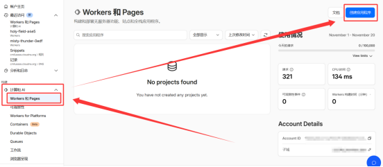

或

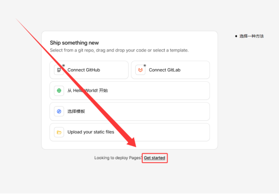

选择 Pages 选项卡，点击 拖放文件 > 开始使用

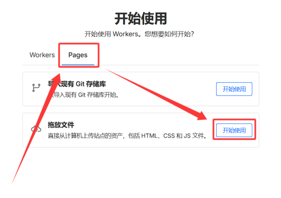

项目名称**填写任意值，但必须是全新的名字，避免出现1101错误**，推荐末尾补上任意数字，如 `edt123123123`

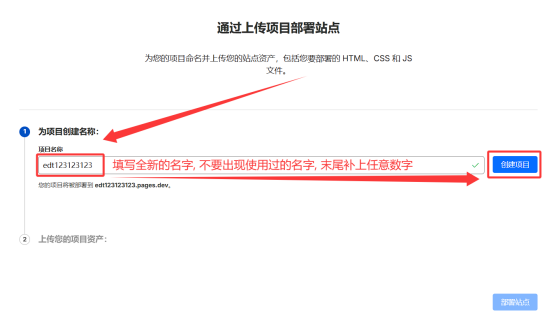

点击 从计算机中选择 > 上传压缩文件，选择第一步下载的 direct-upload-demo.zip 压缩包，等待上传完成

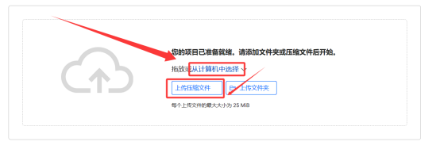

点击 部署站点，等待部署完成

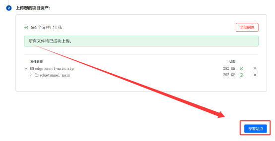

提示成功，代表初始化部署完成！点击 继续处理项目 进入下一步设置变量绑定KV的操作

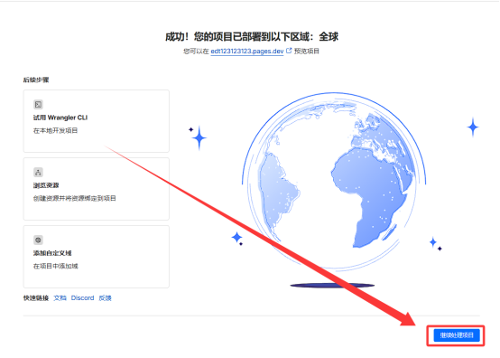

## 设置管理员变量

进入项目设置页面，点击 设置 选项卡，添加变量和机密

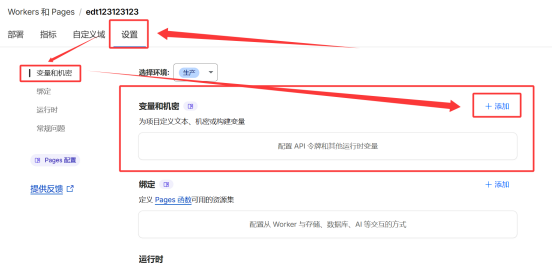

点击 + 添加，类型 文本 变量名称 `ADMIN` 变量，变量值为 **WebUI**管理员密码，建议设置复杂密码，避免被暴力破解

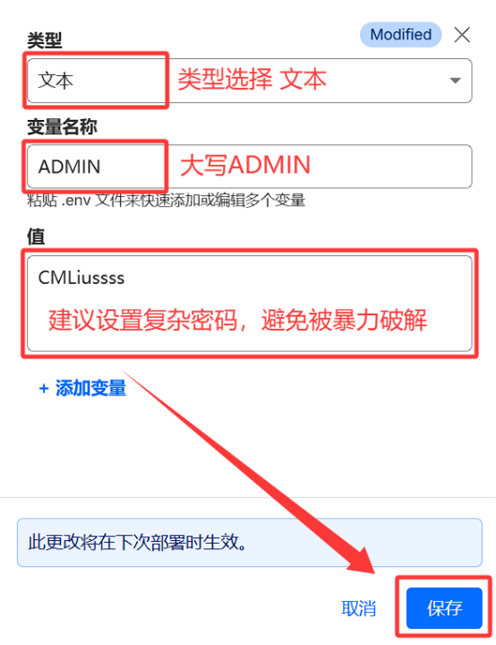

变量即可设置完成，如忘记密码可返回此页面查看

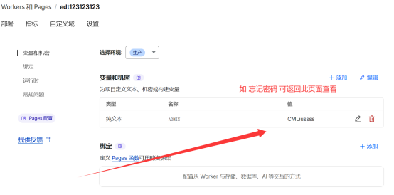

## 绑定 KV 命名空间

点击 存储和数据库 > Workers KV > + Create Instance 创建一个命名空间

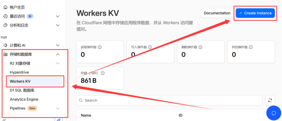

命名空间名称可自定义，建议命名为 `EDT2` 以便区分，点击 创建 完成创建

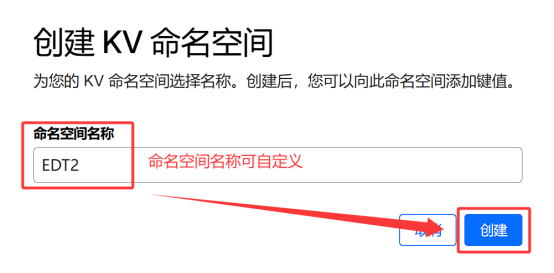

返回项目设置页面，点击 设置 > 绑定 > + 添加 > KV 命名空间

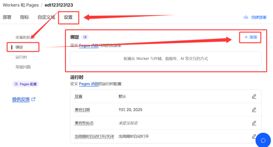

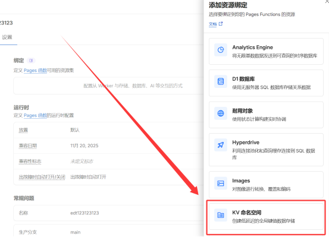

变量名称必须填写大写 `KV`，命名空间选择刚刚创建的 `EDT2`，点击 保存 完成绑定

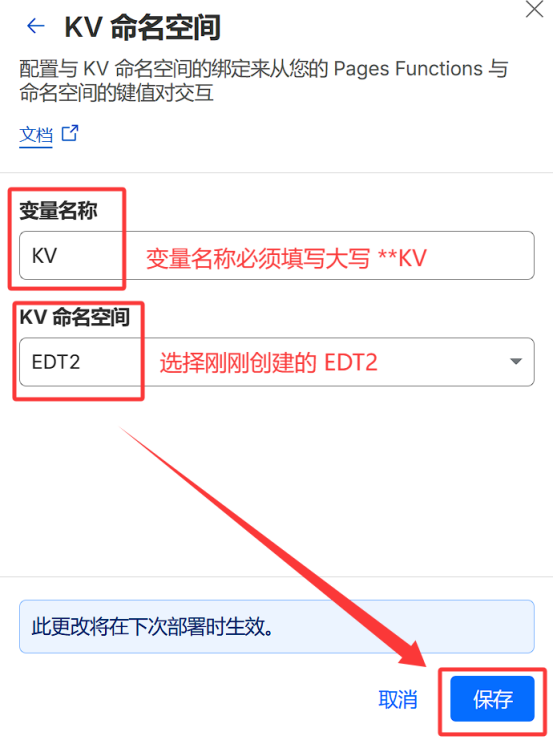

返回项目设置页面，确认绑定成功

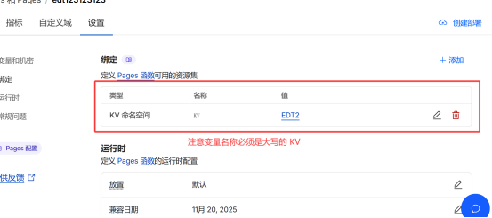

## 重试部署，使其变量生效

点击右上角 创建部署，上传第一步刚刚下载的 edgetunnel-main.zip 压缩包

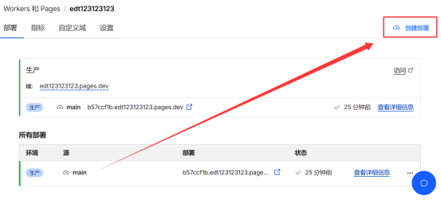

部署环境选择 生产，点击 从计算机中选择 > 上传压缩文件，选择第一步下载的压缩包，等待上传完成

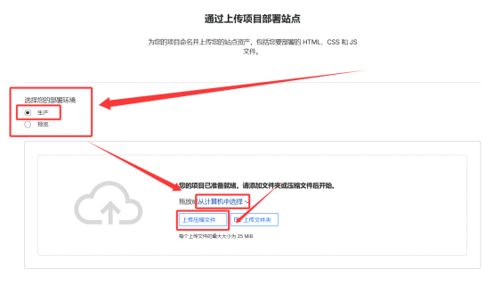

点击 保存并部署，等待部署完成

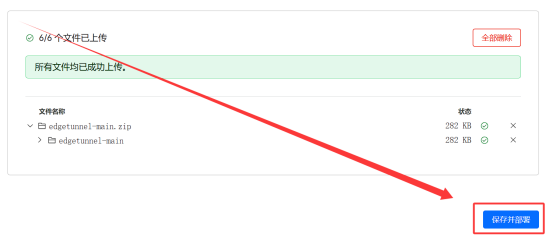

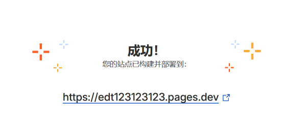

如需修改管理员密码，修改完变量之后**必须重新上传部署，否则变量无法生效！**

## 绑定自定义域名

进入 Pages 应用程序，点击 自定义域 选项卡，点击 设置自定义域

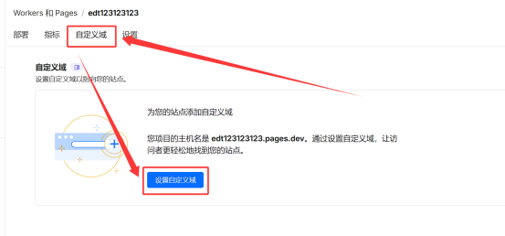

添加自定义域

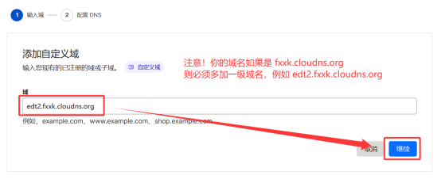

选择开始 CNAME 设置

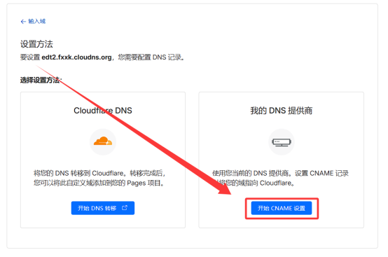

记录名称 `edt2` 和 CNAME 记录值 `edt123123123.pages.dev`

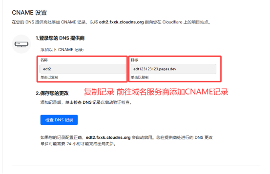

前往域名服务商添加CNAME记录

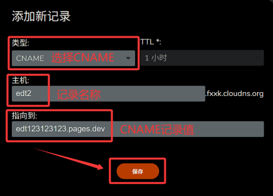

返回 自定义域 选项卡，点击 稍后完成 DNS 设置 等待域名验证成功

**等待10~30分钟**，域名验证成功后即可看到域名绑定成功提示

## 登录 EDT2 管理页面

访问 `/admin` 即可登录管理页面，例如您绑定的自定义域名 `edt2.fxxk.cloudns.org` ，则您需访问对应地址 <https://edt2.fxxk.cloudns.org/admin>

输入管理员密码，点击 登录 即可进入管理页面

登录成功后，即可看到管理页面，如果您是小白，无需折腾直接订阅使用即可

部署成功后访问主页提示 Welcome to nginx!，这只是默认伪装页，说明你已部署成功，请访问 `/admin` 进入管理页面

## 自助优选订阅

当前 Edgetunnel2.0 自带了三种优选订阅生成方式，分别是：

- 随机优选
- 简单
- 内置三网优选IP：根据订阅时的网络自动分配对应三网优选IP，优选IP想要多少就有多少！
