# cloudflare-edgetunnel

> Ref: https://x.com/Pangty06116/status/2040265254719078441?s=20

## 🛠️ 第一步：搞定免费域名，并托管到 CF

注意：千万别用 CF 自带的 <http://workers.dev> 域名，早就被墙烂了。

1. 去 DNSHE 平台注册个免费域名（推荐 .us.ci 这种冷门后缀，容易过)。注册免费域名： <https://www.dnshe.com/>

1. 登录 Cloudflare（免费注册即可），把刚申请的域名添加进去托管。注册 cloudflare 账号：<https://cloudflare.com/zh-cn/>

1. 回到 DNSHE，把域名的 DNS 修改成 CF 提供的地址，耐心等 CF 状态变成“有效”。

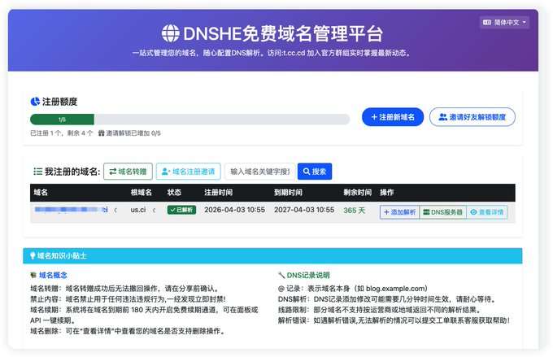

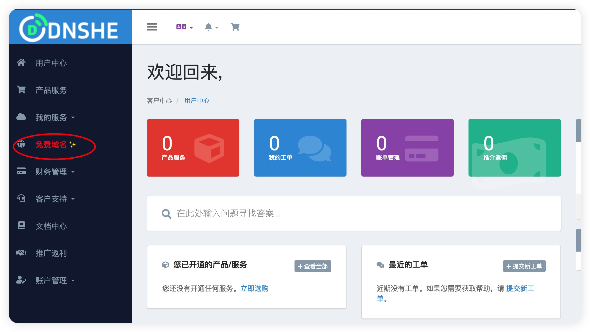

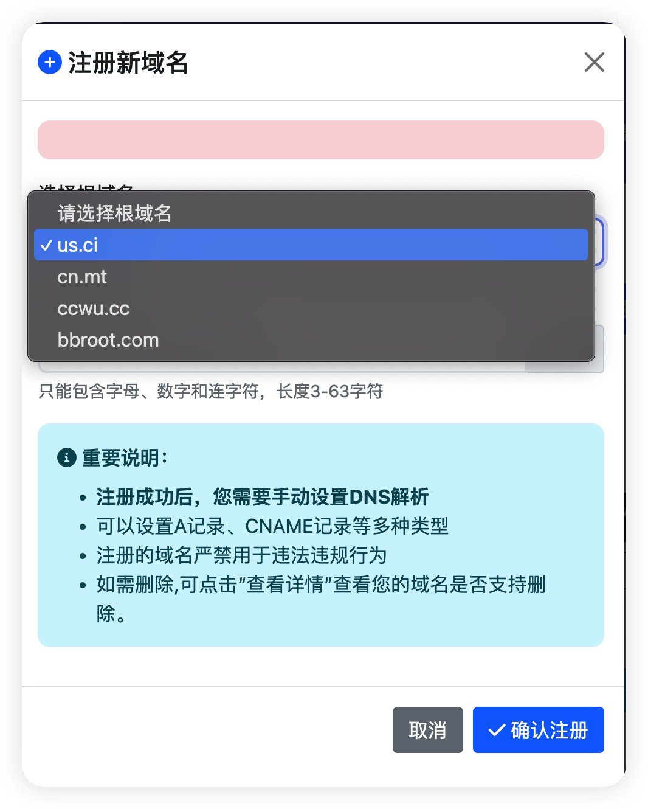

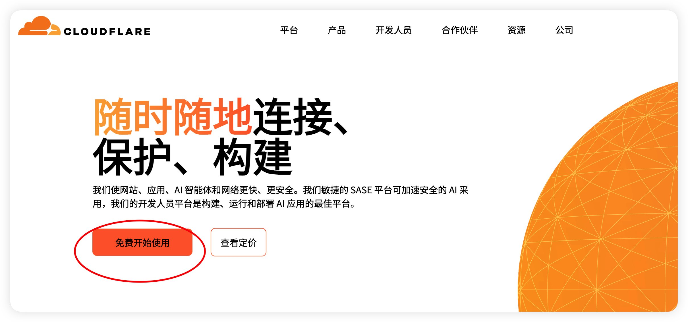

## ⚙️ 第二步：部署核心后端 (Pages)

这步我们用 CF Pages 部署开源项目 Edgetunnel，比老旧的 Workers 方法更稳定。

在 CF 后台点 `Storage & databases` -> `Workers KV`，随便建个命名空间（名字自定义随便取）。

转到 `Compute` -> `Workers & Pages`， 下面有一行小字写的是 `Looking to deploy Pages? Get started` 选择 `Get started`。

把准备好的 edgetunnel 代码包传上去（Zip上传或连 GitHub 部署都行）。由 CMliu 开源的程序源码地址：<https://github.com/cmliu/edgetunnel/>；或者小白直接下载现成的压缩包：<https://github.com/cmliu/edgetunnel/archive/refs/heads/main.zip>

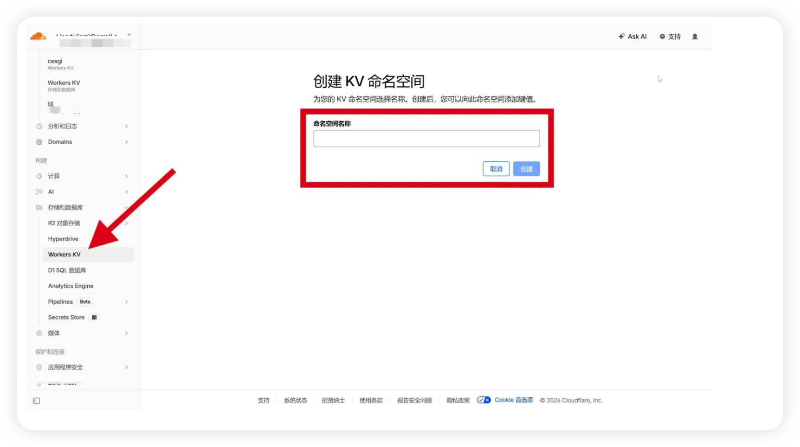

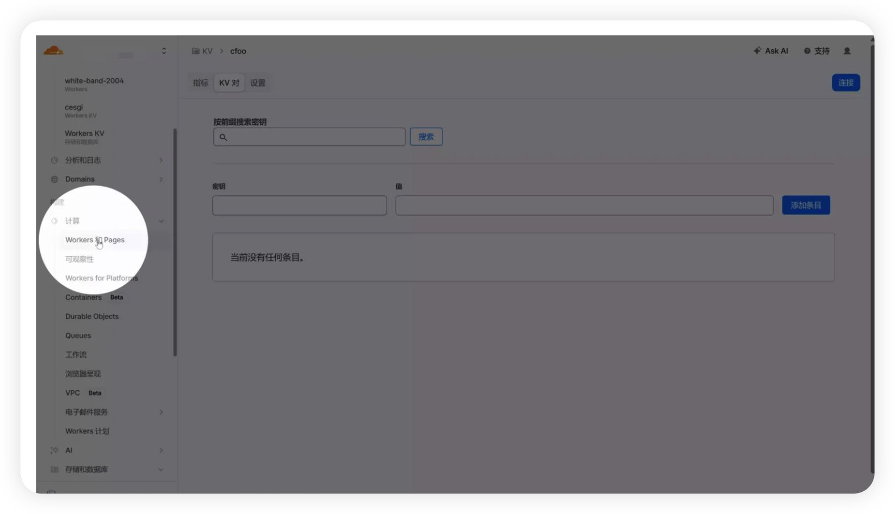

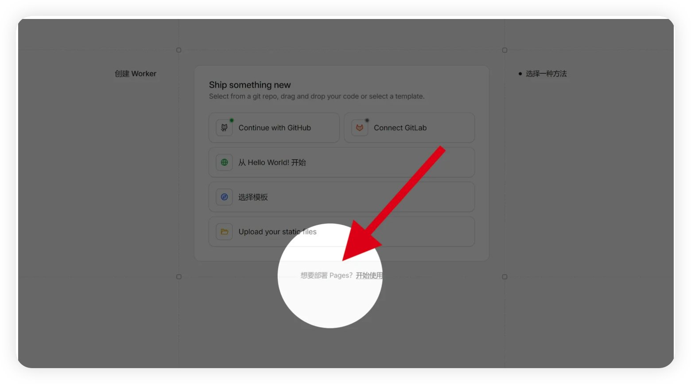

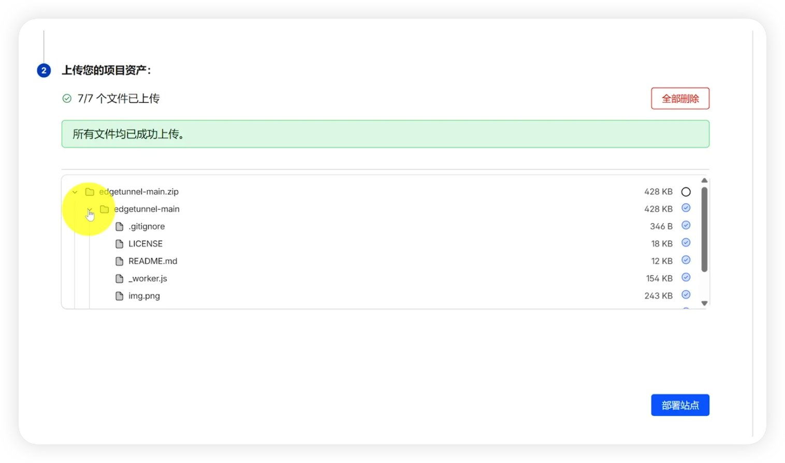

## 🔒 第三步：绑定域名与安全配置（环境变量设置）

1. 部署完成后点击 继续处理站点 后，选择 `Settings` -> `Variables and Secrets` > `+ Add`。 变量名称填写 `ADMIN`，值则为你的管理员密码，后点击 `Deploy` 即可。返回 部署 选项卡，在右下角点击 创建新部署 后，重新上传 [main.zip](https://github.com/cmliu/edgetunnel/archive/refs/heads/main.zip) 文件后点击 保存并部署 即可。

1. 绑定 KV 命名空间：
在 设置选项卡中选择 `Bindings` -> `+ Add` -> `KV namespace`，变量名称填写 `KV`，然后选择一个已有的命名空间或创建一个新的命名空间进行绑定。然后点击 `Save`。

1. 给 Pages绑定 CNAME自定义域：
在 Pages控制台的 `Settings` -> `Custom domains` -> `Set up a custom domain`。
填入你的自定义次级域名，注意不要使用你的根域名，例如： 您分配到的域名是 [xxxxxx.us.ci](xxxxxx.us.ci)，则添加自定义域填入 [xxxxxx.us.ci](xxxxxx.us.ci) 即可.然后点 `Continue`；
在新标签页打开 <https://dash.cloudflare.com/>, 找到 `Domains` -> `Overview` -> 选择本次要用的域名 -> 右侧有一个 `DNS Records` -> `+ Add record` -> 选择上个页面要求添加的 Type (CNAME), Name, Target (对应上个页面的 Content)

按照 CF 的要求将返回你的域名DNS服务商，添加 该自定义域 lizi的 CNAME记录 <http://edgetunnel.pages.dev> 后，返回上个页面, 点击 `Active domain` 即可。

然后再去这个page控制台的`Deployments` -> All deployments -> 右侧三个点 -> `Retry deployment` -> 等待 Status 变成 Success

1. 访问后台：
例如：以我的后台为实例访问： <https://pangty06116.us.ci/admin>
输入管理员密码即可登录后台。

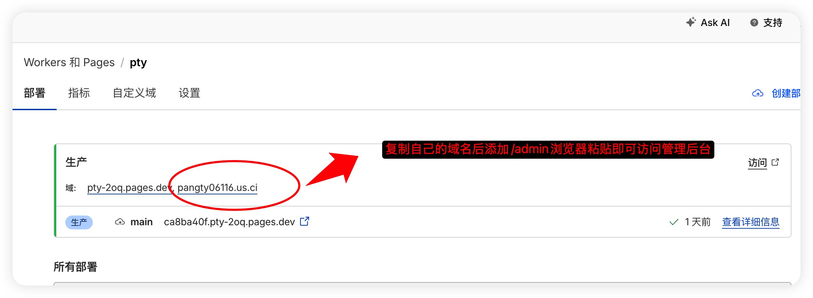

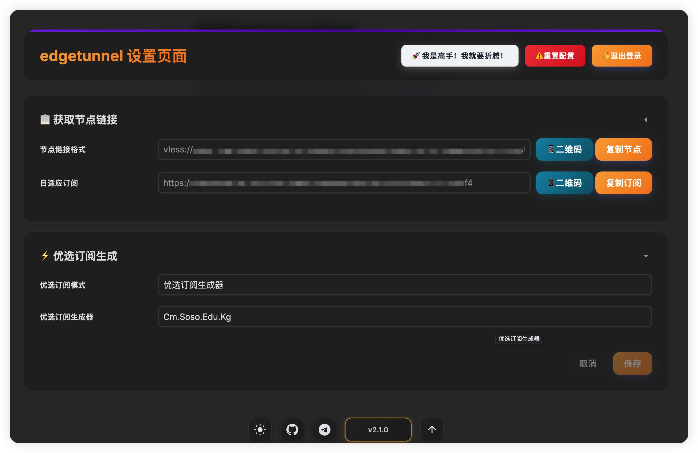

## 🚀 第四步：获取节点，速度拉满

浏览器访问 你的域名/你的UUID，进入酷炫的后台页面，直接复制 VLESS 节点或者通用订阅链接。

打开客户端（如 v2rayN、小火箭）导入链接。

🔥 敲黑板（高阶玩法）：直接连可能慢。可自选下列“CF 优选 IP”，或者网上自选资源。把客户端里的「地址(Address)」改成优选 IP，但「伪装域名(SNI)」必须保持你的免费域名不变！这样网速直接起飞！小白不愿意折腾直接默认PROXYIP自选即可。通用订阅链接基本能满足主流代理软件使用。

当然如果你需要自定义更多的选项，比如优选订阅地址，指定ProxyIP订阅，那么可以点击顶部的：我是高手！我就是要折腾！

优选订阅地址：

| Url                 | Description                        |
| ------------------- | ---------------------------------- |
| sub.cmliussss.net   | no japan                           |
| owo.o00o.ooo        | no region                          |
| cm.soso.edu.kg      | with region                        |
| zrf.zrf.me          | no region                          |
| sub.keaeye.icu      | too less                           |
| sub.mot.cloudns.biz | no region                          |
| cfsub.cfcdn.xx.kg   | less japan, too many invalid nodes |
| sub.lzjbaby.com     | with region                        |

PROXYIP 订阅:

| Url                      | Description    |
| ------------------------ | -------------- |
| ProxyIP.CMLiussss.net    | 区域: 全球     |
| ProxyIP.HK.CMLiussss.net | 区域: 香港     |
| ProxyIP.SG.CMLiussss.net | 区域: 新加坡   |
| ProxyIP.JP.CMLiussss.net | 区域: 日本     |
| ProxyIP.KR.CMLiussss.net | 区域: 韩国     |
| ProxyIP.IN.CMLiussss.net | 区域: 印度     |
| ProxyIP.GB.CMLiussss.net | 区域: 英国     |
| ProxyIP.FR.CMLiussss.net | 区域: 法国     |
| ProxyIP.DE.CMLiussss.net | 区域: 德国     |
| ProxyIP.NL.CMLiussss.net | 区域: 荷兰     |
| ProxyIP.SE.CMLiussss.net | 区域: 瑞典     |
| ProxyIP.FI.CMLiussss.net | 区域: 芬兰     |
| ProxyIP.PL.CMLiussss.net | 区域: 波兰     |
| ProxyIP.RU.CMLiussss.net | 区域: 俄罗斯   |
| ProxyIP.CH.CMLiussss.net | 区域: 瑞士     |
| ProxyIP.LV.CMLiussss.net | 区域: 拉脫維亞 |
| ProxyIP.US.CMLiussss.net | 区域: 美国     |
| ProxyIP.CA.CMLiussss.net | 区域: 加拿大   |
| kr.william.us.ci         |                |
| tw.william.us.ci         |                |

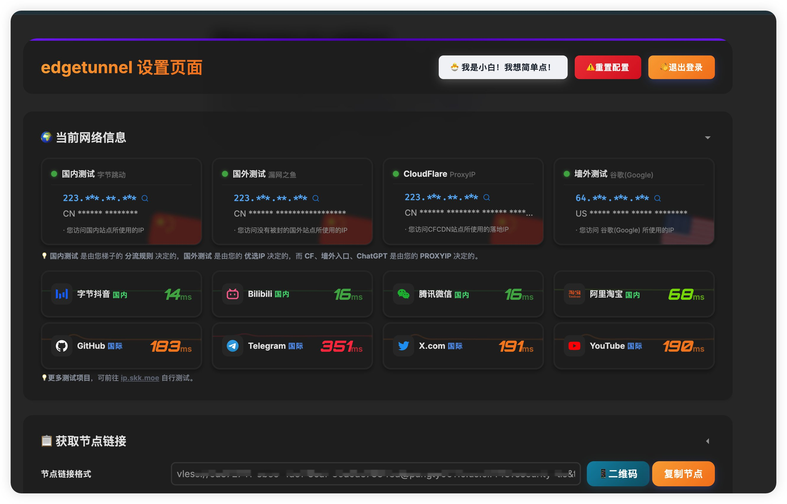

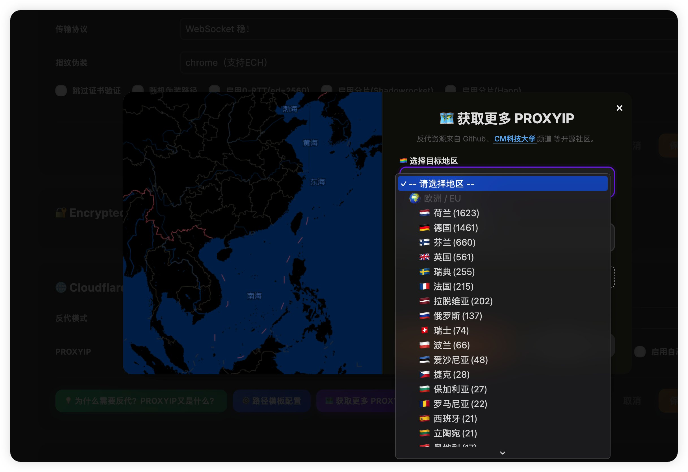

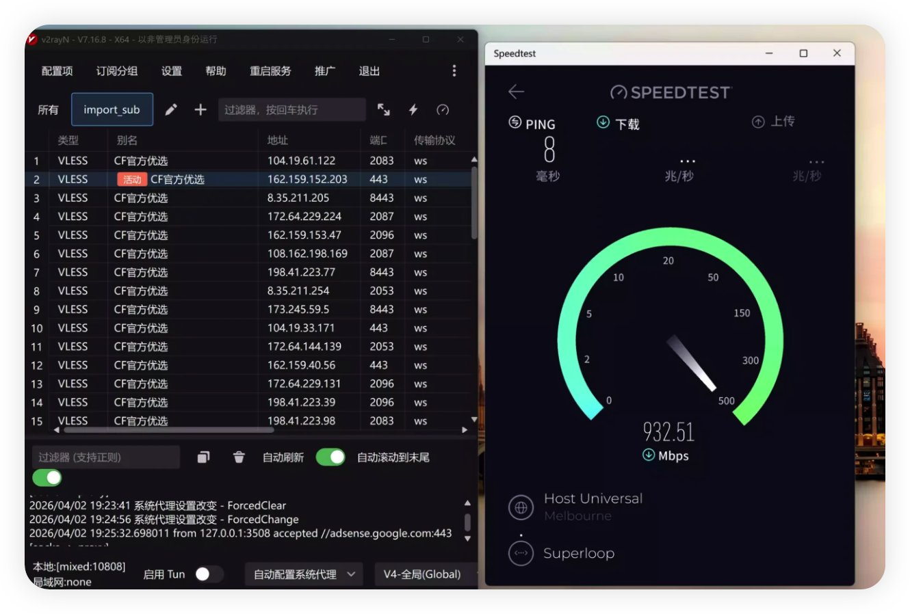

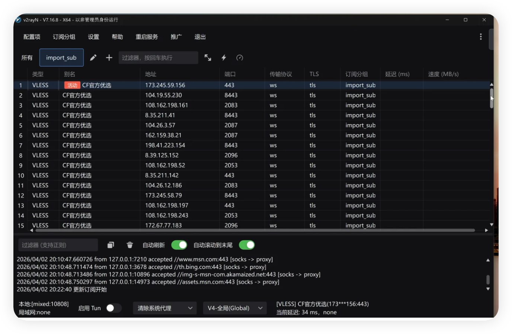

