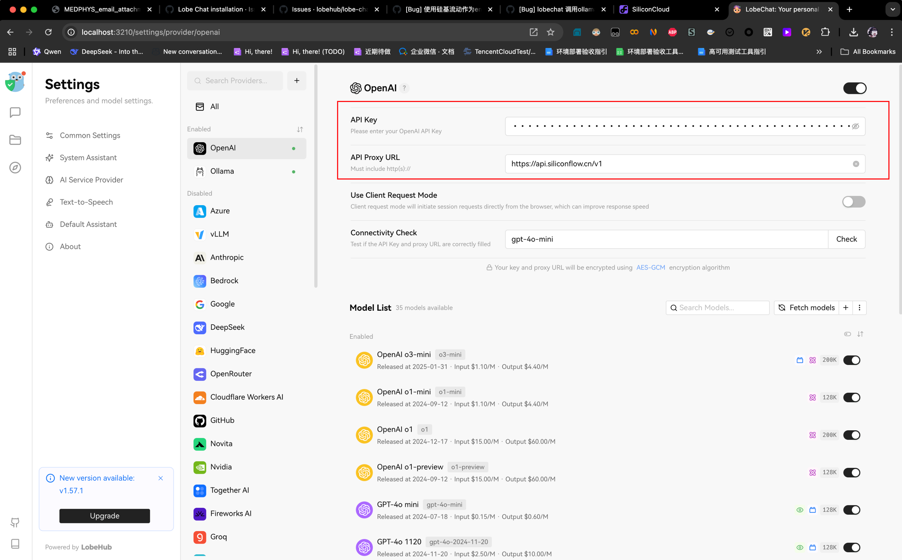

# AI workflow software

## Openai official ChatGPT

需要：
ios设备，梯子环境，美区账号(地区在美国五个免税州内)，支付宝，chatgpt账号

步骤：

- ios设备，地区切换到美国，系统语言切换英文
- 美区账号下载chatgpt app
- 通过支付宝小程序给美区账号充值礼品卡
- chatgpt app登录账号，通过美区账号充值gpt4

其他：
到这个[链接](https://platform.openai.com/api-keys)中登录获取api key,然后部署到其他地方(但由于后面好像还要充值，没再继续部署)

## API keys

> Ref: <https://www.v2ex.com/t/1108382>

- <https://luee.net/key> ，速度快，但是感觉不是o3-mini
- <https://siliconflow.cn> ，可用deepseek。<https://deepinfra.com>
- All in one：<https://www.closechat.org/> ，速度快，并且是o3-mini，但是太贵
- 某宝还买了中转api，速度慢，只能o1-mini。直连key效果还行

## Chatbots

- chatbot arena
- chatgpt next web
- lobe chat 一键本地部署（选择第二个模式，port mode）：<https://github.com/lobehub/lobe-chat/blob/main/docker-compose/setup.sh>
- chatbox:桌面端/移动端都可用
- cherry studio
- anythingllm
- RAGFlow
- dify (non-free)
- deepclaude

## Ollama

### Deploy ollama with Chinese mirror

> Ref: <https://tianhao.tech/default/ollama-installation-guide-china.html>

```bash
curl -fsSL https://ollama.com/install.sh -o ollama_install.sh
```

Replate the download URL in `ollama_install.sh`:

```bash
#!/bin/bash

FILE="ollama_install.sh"

sed -i 's|https://ollama.com/download/ollama-linux-${ARCH}${VER_PARAM}|https://github.moeyy.xyz/https://github.com/ollama/ollama/releases/download/v0.3.4/ollama-linux-amd64|g' $FILE
sed -i 's|https://ollama.com/download/ollama-linux-amd64-rocm.tgz${VER_PARAM}|https://github.moeyy.xyz/https://github.com/ollama/ollama/releases/download/v0.3.4/ollama-linux-amd64-rocm.tgz|g' $FILE
```

```bash
http_proxy=127.0.0.1:7890 https_proxy=127.0.0.1:7890 ollama run deepseek-r1:32b
```

### Deploy ollama in autodl machine

> Ref: <https://blog.csdn.net/tirestay/article/details/139773544>

```bash
source /etc/network_turbo
sudo apt update
sudo apt install systemd systemctl lshw
curl -fsSL https://ollama.com/install.sh | sh
# systemctl start ollama.service
# kill -9 [ollama process number]
http_proxy=127.0.0.1:7890 https_proxy=127.0.0.1:7890 OLLAMA_MODELS=/root/autodl-tmp/ollama ollama serve
http_proxy=127.0.0.1:7890 https_proxy=127.0.0.1:7890 OLLAMA_MODELS=/root/autodl-tmp/ollama ollama run deepseek-r1:70b
```

## GPT Academic (in autodl machine)

```bash
source /etc/network_turbo
http_proxy=127.0.0.1:7890 https_proxy=127.0.0.1:7890 git clone --depth=1 https://github.com/binary-husky/gpt_academic.git
cd gpt_academic
cp config.py config_private.py
vim config_private.py
conda init
source ~/.bashrc
conda create -n gptac_venv python=3.11
conda activate gptac_venv
python -m pip install -r requirements.txt
python main.py
```

## Lobe Chat

### Deploy Lobe Chat with docker compose

```text
lobe chat main branch, commit: 2dc712a9be7a8a62a677bfd4220b686eeb0f6b11
```

注意：重新安装时，只需要删掉lobe-chat容器，然后拉取最新lobe-chat容器，执行`docker compose up -d`。不要删除`docker-compose.yml`和`init_data.json`，也不要删除`data`和`s3_data`。否则之前的数据就丢失了。代码是否拉取最新的无所谓。因为使用的并不是最新代码提供的docker compose文件，而是本地的。

```bash
docker rm -f lobe-chat
docker pull lobehub/lobe-chat-database:latest
docker compose up -d  # Or: docker-compose up -d
```

```bash
pwd
# /Users/yusongli/Documents/lobe-chat/docker-compose

docker rm -f lobe-chat lobe-minio lobe-casdoor lobe-network lobe-postgres
rm -rf data s3_data
cp local/docker-compose.yml local/init_data.json .
cp local/.env.example .env
sed -i 's#./server --createDatabase=true#sleep 5; ./server --createDatabase=true#g' docker-compose.yml
# Add `S3_SET_ACL=0` to lobe chat for minio
# sed -i "0,/^\\([ \t]*\\).*S3_BUCKET.*/ { // { h; s//\\1- 'S3_SET_ACL=0'/; H; x; } }" docker-compose.yml
# For embedding:
echo "\nDEFAULT_FILES_CONFIG=embedding_model=siliconcloud/Pro/BAAI/bge-m3" >> .env
sed -i "0,/^\\([ \t]*\\).*NEXT_AUTH_SSO_PROVIDERS.*/ { // { h; s//\\1- 'DEFAULT_FILES_CONFIG=\${DEFAULT_FILES_CONFIG}'/; H; x; } }" docker-compose.yml
# sed -i 's/host=postgresql/host="host.docker.internal"/g' docker-compose.yml
# sed -i 's/postgresql:5432/host.docker.internal:5432/g' docker-compose.yml
patch < diff
bash setup.sh
docker compose up -d  # Or: docker-compose up -d
```

```diff
diff --git a/docker-compose/setup.sh b/docker-compose/setup.sh
index c52770aac..fcd1dbeb3 100644
--- a/docker-compose/setup.sh
+++ b/docker-compose/setup.sh
@@ -6,13 +6,13 @@

 # check operating system
 # ref: https://github.com/lobehub/lobe-chat/pull/5247
-if [[ "$OSTYPE" == "darwin"* ]]; then
-    # macOS
-    SED_COMMAND="sed -i ''"
-else
+# if [[ "$OSTYPE" == "darwin"* ]]; then
+#     # macOS
+#     SED_COMMAND="sed -i ''"
+# else
     # not macOS
     SED_COMMAND="sed -i"
-fi
+# fi

 # ======================
 # == Process the args ==
@@ -446,8 +446,8 @@ section_download_files(){
 if [ -d "data" ] || [ -d "s3_data" ]; then
     show_message "tips_already_installed"
     exit 0
-else
-    section_download_files
+# else
+#     section_download_files
 fi

 section_configurate_host() {
@@ -480,7 +480,11 @@ section_configurate_host() {

     # If user not specify host, try to get the server ip
     if [ -z "$HOST" ]; then
-        HOST=$(hostname -I | awk '{print $1}')
+        if [[ "$OSTYPE" == "darwin"* ]]; then
+            HOST=$(ifconfig en0 |awk '/inet / {print $2; }')
+        else
+            HOST=$(hostname -I | awk '{print $1}')
+        fi
         # If the host is a private ip and the deploy mode is port mode
         if [[ "$DEPLOY_MODE" == "1" ]] && ([[ "$HOST" == "192.168."* ]] || [[ "$HOST" == "172."* ]] || [[ "$HOST" == "10."* ]]); then
             echo $(show_message "tips_private_ip_detected")
```

### Embedding model configuration

同样的问题，使用env进行配置时，向量化时返回的错误时401, provider: siliconcloud, 但如果通过webui配置openai key为对应的SILICONCLOUD_API_KEY, 向量化返回的错误是413, 可判断出来embedding model是用了siliconcloud，但是key还是用的openai key...

关键的env配置如下

```bash
SILICONCLOUD_API_KEY=sk-xxxxxxxxxxxx
SILICONCLOUD_PROXY_URL=https://api.siliconflow.cn/v1/
DEFAULT_FILES_CONFIG=embedding_model=siliconcloud/netease-youdao/bce-embedding-base_v1
```

刚刚去看了代码实现，代码实现是通过从`$DEFAULT_FILES_CONFIG` 截取 PROVIDER 来组合提取env中存在的`${PROVIDER}_API_KEY`,`${PROVIDER}_PROXY_URL` 来构建对应的请求的，如果没有`${PROVIDER}_API_KEY`会使用`$OPENAI_API_KEY`来兜底，兜底这个行为本身需要斟酌，因为可能导致没有正确配置的环境把openai的key暴露到不匹配的provider，但是代码逻辑本身没有问题。
最后我使用相同环境下重新部署了一次，没有再次复现这个问题。

PS: 413是因为该模型不支持1024维，换了BAAI后正常。

把这里换成siliconflow的key和proxy，用于embedding模型


