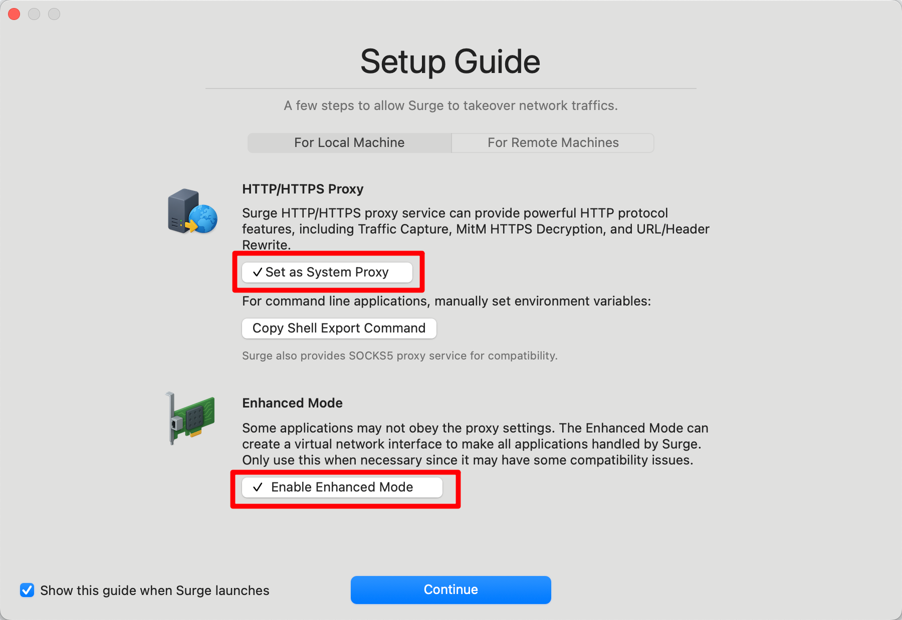
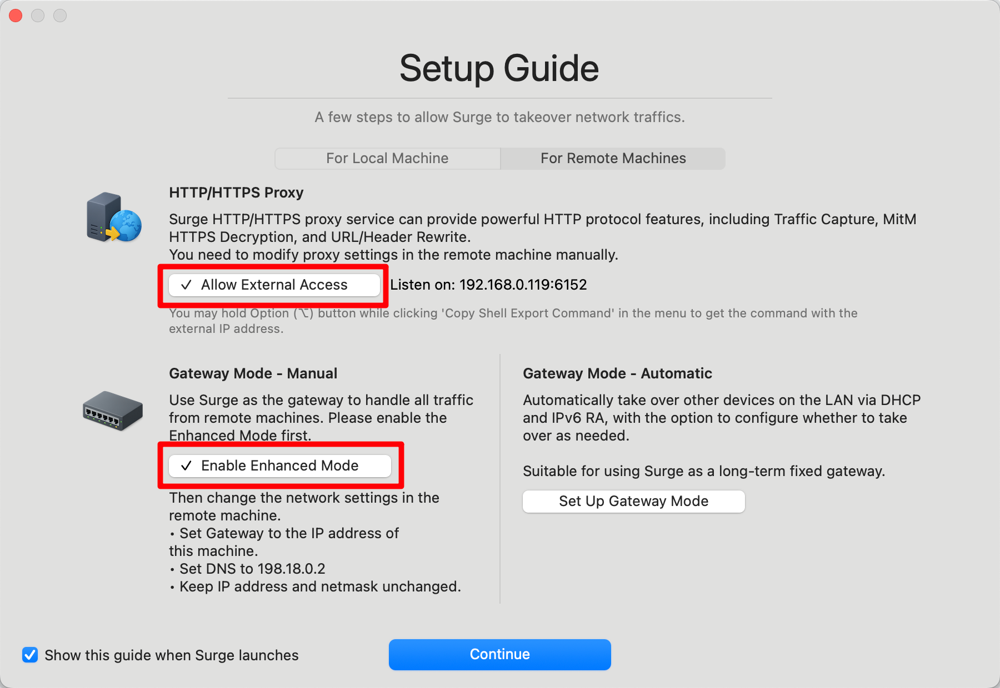
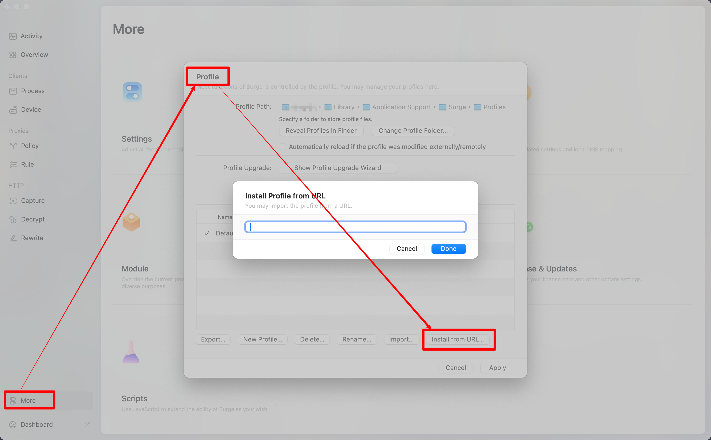
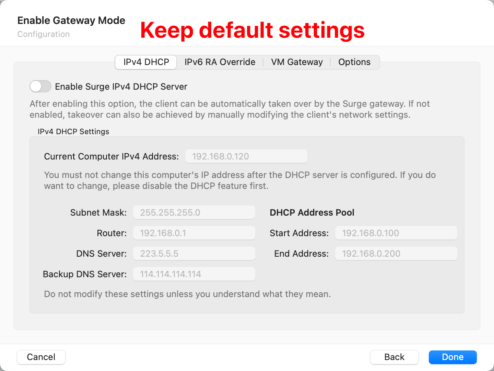
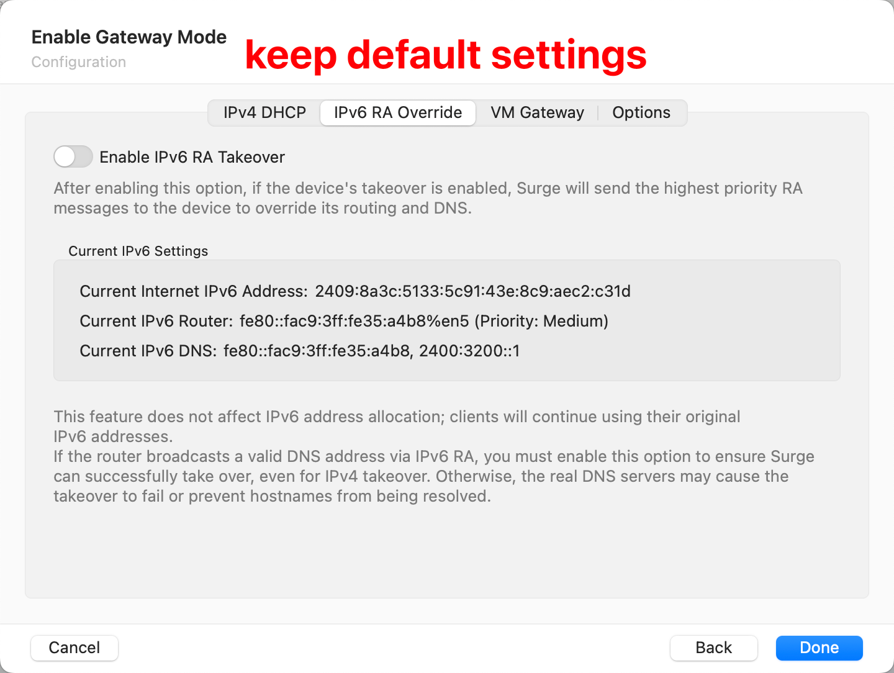
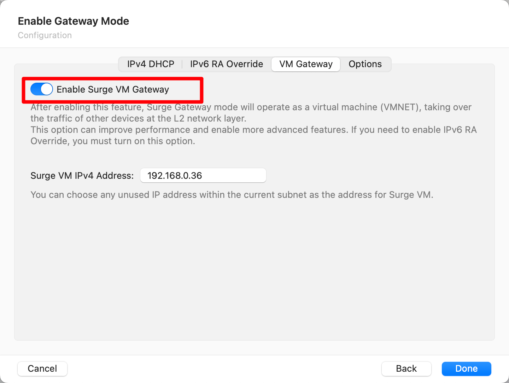
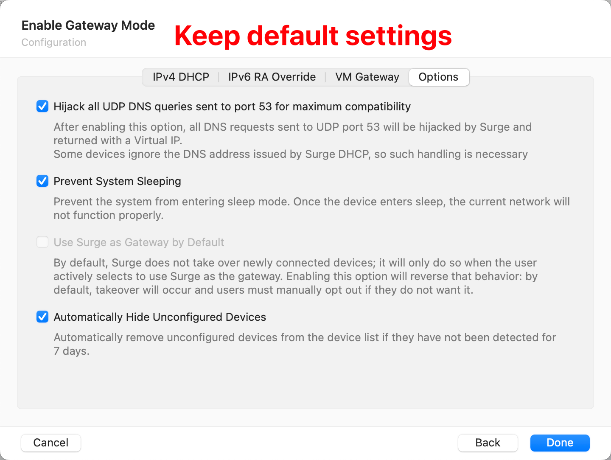
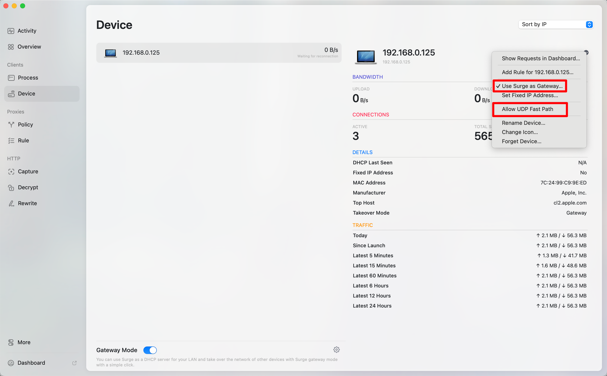

# surge-mac

> Ref: <https://nssurge.com>

## Installation

```bash
brew install --cask surge
```

The default ports are as follows:

```bash
export HTTP_PROXY=http://127.0.0.1:6152
export HTTPS_PROXY=http://127.0.0.1:6152
export ALL_PROXY=socks5://127.0.0.1:6153
```

## Basic Configuration

<p></p>

<p></p>

## Usage

### Import proxy

For <https://vpnuk.net>, refer to: <https://github.com/huya5332-ops/cte-wifi-calling-configs>

For others, refer to this picture below:

<p></p>

### Set gateway

> Refer to: <https://kb.nssurge.com/surge-knowledge-base/guidelines/gateway#configuration-steps>

1. Enable "Enhanced Mode" or "VM Gateway" in Surge Mac.
2. On the device to be taken over, go to its network settings.
3. Change its **gateway address** to the IP address of the device running Surge Mac (if using VM Gateway, set it to the IP address of the VM Gateway).
4. Change its **DNS server** address to **`198.18.0.2`**.

**Note**: The DNS address should be **`198.18.0.2`**, not `192.168.x.x`.

<p></p>

<p></p>

<p></p>

<p></p>

<p></p>
