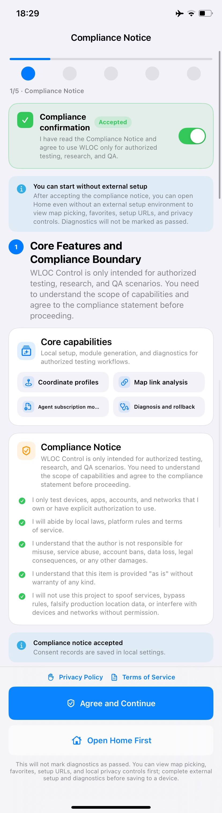
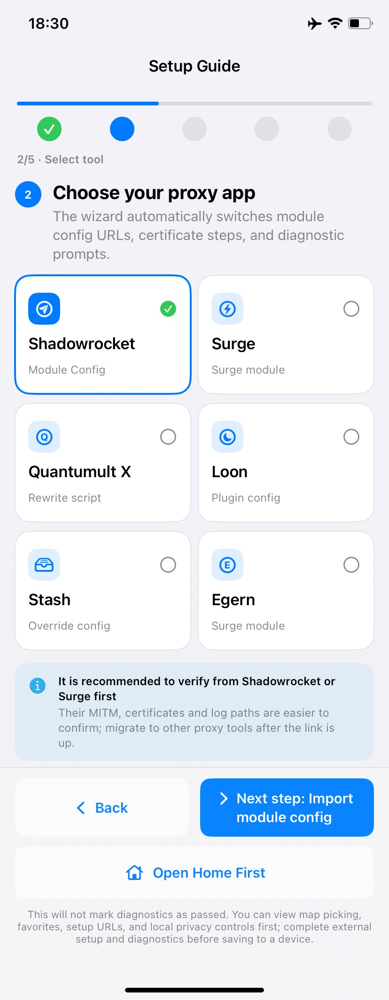
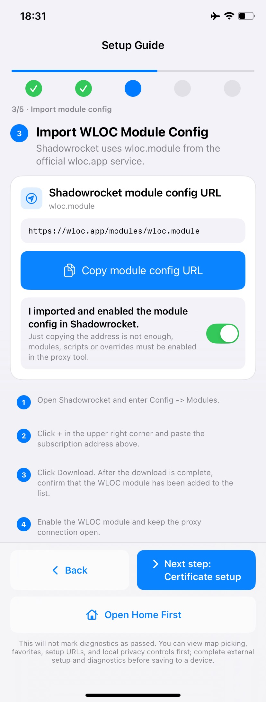
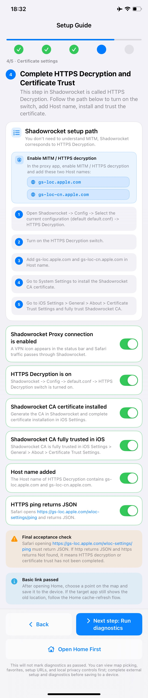
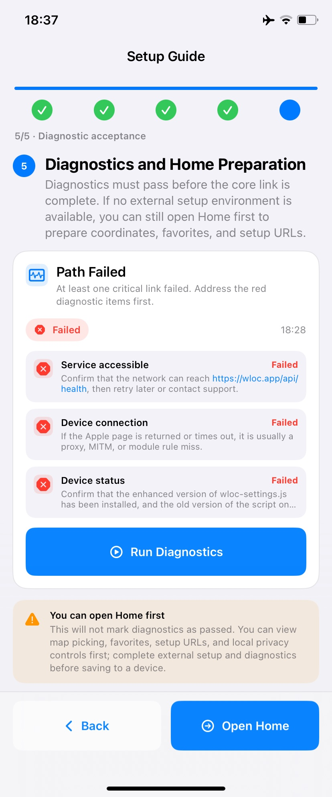

# wloc

> Ref:
>
> - <https://x.com/hejushang8/status/2083388212240863267>
> - <https://github.com/Yu9191/wloc>
> - <https://apps.apple.com/us/app/wloc/id6785566876>

Select locaton by iPhone, use Safari to visit <https://wloc-spoofer.wloc.workers.dev/>

Change location -> Turn off location service -> Switch on flight mode -> Turn on location service -> Switch off flight mode

