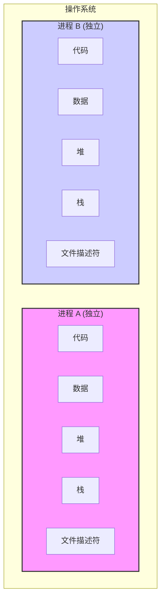
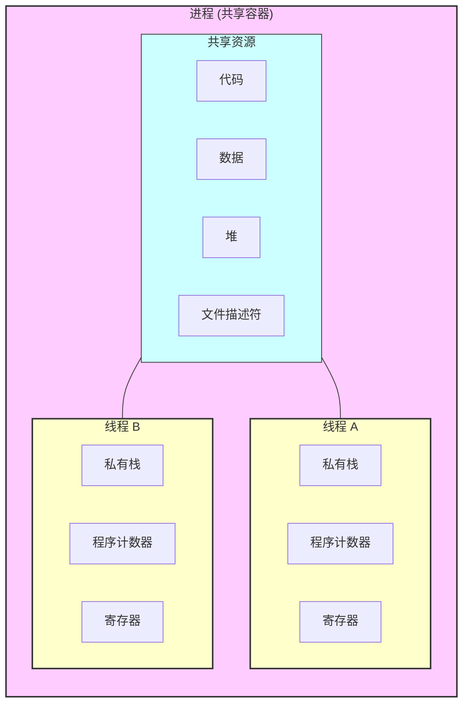

# 多进程 vs. 多线程：核心区别与资源共享

## 核心区别对比

| 特性         | 多进程 (Multiprocessing)                                                       | 多线程 (Multithreading)                                                                |
| :----------- | :----------------------------------------------------------------------------- | :------------------------------------------------------------------------------------- |
| **基本单位** | 操作系统进行资源分配和调度的独立单位                                           | CPU调度的基本单位，依附于进程存在                                                      |
| **资源共享** | 进程间相互独立，拥有各自独立的内存地址空间、数据、堆和栈。默认不共享任何资源。 | 同一进程内的所有线程共享该进程的内存地址空间、全局变量、静态数据、堆、文件描述符等。   |
| **私有资源** | 每个进程拥有完整的私有资源集。                                                 | 每个线程拥有自己独立的**栈（Stack）**、**程序计数器（PC）**和**寄存器（Registers）**。 |
| **创建开销** | 高。需要分配独立的内存空间和系统资源。                                         | 低。只需创建线程私有的栈和寄存器等少量资源。                                           |
| **切换开销** | 高。需要切换整个页表和内核上下文。                                             | 低。只需切换线程的栈、程序计数器和寄存器，无需切换地址空间。                           |
| **通信方式** | 复杂。需要通过进程间通信（IPC）机制，如管道、套接字、共享内存等。              | 简单。可以直接读写同一进程的共享数据（但需注意同步问题）。                             |
| **健壮性**   | 高。一个进程崩溃不会影响其他进程。                                             | 低。一个线程崩溃会导致整个进程（包括所有其他线程）崩溃。                               |
| **适用场景** | CPU密集型任务，利用多核优势并行计算。                                          | I/O密集型任务，利用线程切换提高并发性和响应速度。                                      |

## 资源共享Mermaid图

### 多进程模型

**解读**: 在多进程模型中，每个进程（如进程A和进程B）都是一个完全独立的容器，拥有自己全套的资源。它们之间不共享内存，像两个完全隔离的程序。

### 多线程模型

**解读**: 在多线程模型中，所有线程（如线程A和线程B）都存在于同一个进程的“容器”内。它们共享进程的代码、数据、堆等大部分资源，但每个线程都保留了一小部分私有领地，即自己的栈、程序计数器和寄存器，以确保能够独立执行。
