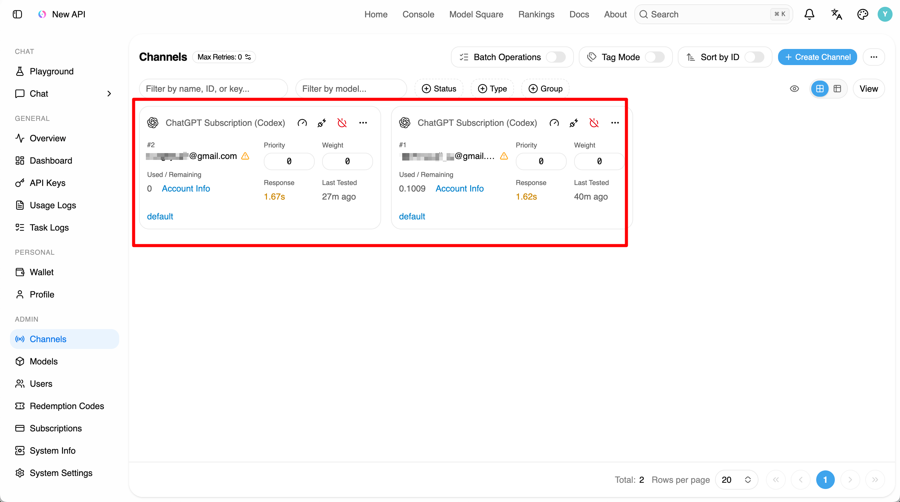
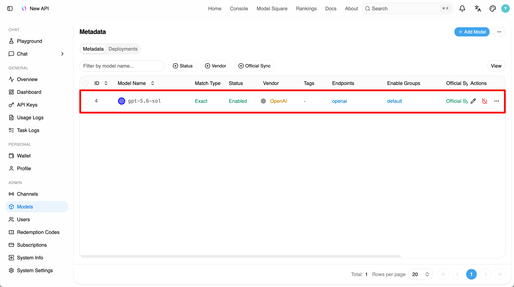
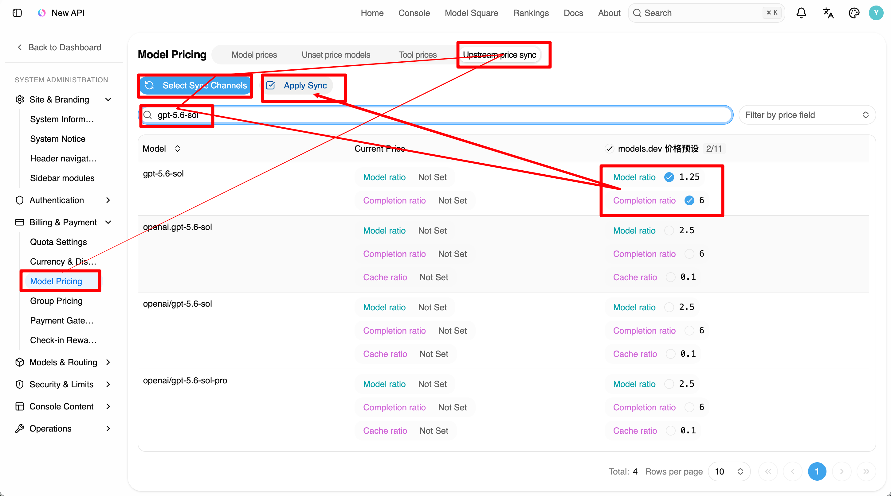

# new-api

## Installation

```bash
git clone git@github.com:QuantumNous/new-api.git
cd new-api
vim docker-compose.override.yml
```

```yaml
# Add the following environment variables to `docker-compose.override.yml`
services:
  new-api:
    environment:
      - HTTP_PROXY=http://host.docker.internal:7892
      - HTTPS_PROXY=http://host.docker.internal:7892
      - NO_PROXY=localhost,127.0.0.1,::1,postgres,redis,host.docker.internal
      - http_proxy=http://host.docker.internal:7892
      - https_proxy=http://host.docker.internal:7892
      - no_proxy=localhost,127.0.0.1,::1,postgres,redis,host.docker.internal
```

```bash
# 1. Pull the three images via the DaoCloud registry mirror
docker pull docker.m.daocloud.io/calciumion/new-api:latest
docker pull docker.m.daocloud.io/library/postgres:15
docker pull docker.m.daocloud.io/library/redis:latest

# 2. Retag them to the image names referenced by docker-compose.yml
docker tag docker.m.daocloud.io/calciumion/new-api:latest calciumion/new-api:latest
docker tag docker.m.daocloud.io/library/postgres:15 postgres:15
docker tag docker.m.daocloud.io/library/redis:latest redis:latest

# 3. Start the stack (new-api + PostgreSQL + Redis)
docker compose up -d

# 4. Wait for the database and schema migrations to be ready
sleep 15

# 5. Switch to the new frontend (rc.21 defaults to the classic frontend, which shows
#    a deprecation banner), then restart to apply
docker compose exec -T postgres psql -U root -d new-api -c \
  "INSERT INTO options (key, value) VALUES ('theme.frontend', 'default') ON CONFLICT (key) DO UPDATE SET value = 'default';"
docker compose restart new-api

# Done. Open http://localhost:3000 — the setup wizard will run on first visit to create the admin account
```

## Codex Configuration

`~.codex/config.toml`

```toml
[model_providers.custom]
base_url = "http://127.0.0.1:3000/v1"
```

`~.codex/auth.json`

```json
{
  "OPENAI_API_KEY": "sk-xxxxxxxxxxxxxxxxxxxxxxxxxxxxxxxxxxxxxxxxxxxxxxx"
}
```

## new-api Configuration

<p></p>

<p></p>

<p></p>
