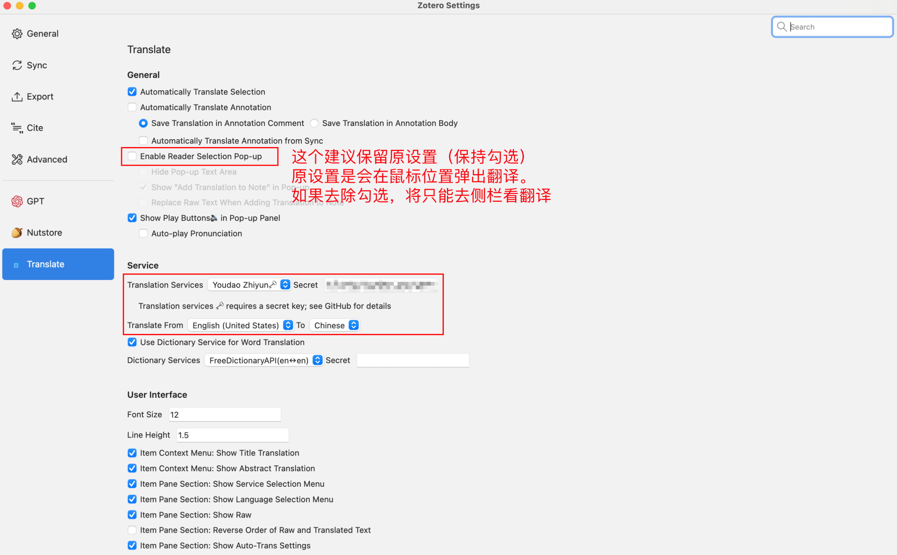

# zotero

Plugin list:

| URL                                                   | Description                                                                                                        |
| ----------------------------------------------------- | ------------------------------------------------------------------------------------------------------------------ |
| <https://github.com/syt2/zotero-addons>               | Zotero Add-on Market \| Zotero插件市场 \| Browsing, installing, and reviewing plugins within Zotero                |
| <https://github.com/nutstore/zotero-plugin-nutstore>  | Nutstore sso plugin for Zotero                                                                                     |
| <https://github.com/windingwind/zotero-pdf-translate> | Translate PDF, EPub, webpage, metadata, annotations, notes to the target language. Support 20+ translate services. |
| <https://github.com/retorquere/zotero-better-bibtex>  | Make Zotero effective for us LaTeX holdouts                                                                        |

---

> Ref: <https://github.com/windingwind/zotero-pdf-translate?tab=readme-ov-file#service>

The secret format is `MY_APPID#MY_SECRET#MY_VOCABID(optional)`. Apply [here](https://ai.youdao.com/console).

---

